# Analysing the Monthly Sunspot Dataset from Machine Learning Mastery

This notebook is used to analyze the 'Shampoo Sales Datase' from the Machine Learning Mastery. The dataset is available [here](https://machinelearningmastery.com/time-series-datasets-for-machine-learning/).

This dataset describes the monthly number of sales of shampoo over a 3 year period.
The units are a sales count and there are 36 observations. The original dataset is credited to Makridakis, Wheelwright and Hyndman (1998).

The notebook is dividede as follows:
    
1. Data exploration
2. Data modelling 
3. Conclusion

## 1. Data exploration

In this section, we explore the characteristics of the dataset, including its dimensions and characteristics of its variables.

The dataset contains only two columns and 36 lines.
The first column of the dataset contains strings denoting the month number and the second column cotains integers denoting the number of passengers for that month.


```python
import pandas as pd
import numpy as np
!pip install -U scikit-learn
```

    Requirement already up-to-date: scikit-learn in /Users/leuzinger/opt/anaconda3/lib/python3.8/site-packages (0.24.2)
    Requirement already satisfied, skipping upgrade: scipy>=0.19.1 in /Users/leuzinger/opt/anaconda3/lib/python3.8/site-packages (from scikit-learn) (1.5.2)
    Requirement already satisfied, skipping upgrade: numpy>=1.13.3 in /Users/leuzinger/opt/anaconda3/lib/python3.8/site-packages (from scikit-learn) (1.19.2)
    Requirement already satisfied, skipping upgrade: threadpoolctl>=2.0.0 in /Users/leuzinger/opt/anaconda3/lib/python3.8/site-packages (from scikit-learn) (2.1.0)
    Requirement already satisfied, skipping upgrade: joblib>=0.11 in /Users/leuzinger/opt/anaconda3/lib/python3.8/site-packages (from scikit-learn) (0.17.0)


```python
df = pd.read_csv('https://raw.githubusercontent.com/jbrownlee/Datasets/master/monthly-sunspots.csv')
df.reset_index(inplace=False)
df.head()
```


<div>
<style scoped>
    .dataframe tbody tr th:only-of-type {
        vertical-align: middle;
    }

    .dataframe tbody tr th {
        vertical-align: top;
    }

    .dataframe thead th {
        text-align: right;
    }
</style>
<table border="1" class="dataframe">
  <thead>
    <tr style="text-align: right;">
      <th></th>
      <th>Month</th>
      <th>Sunspots</th>
    </tr>
  </thead>
  <tbody>
    <tr>
      <th>0</th>
      <td>1749-01</td>
      <td>58.0</td>
    </tr>
    <tr>
      <th>1</th>
      <td>1749-02</td>
      <td>62.6</td>
    </tr>
    <tr>
      <th>2</th>
      <td>1749-03</td>
      <td>70.0</td>
    </tr>
    <tr>
      <th>3</th>
      <td>1749-04</td>
      <td>55.7</td>
    </tr>
    <tr>
      <th>4</th>
      <td>1749-05</td>
      <td>85.0</td>
    </tr>
  </tbody>
</table>
</div>


```python
df.info()
```

    <class 'pandas.core.frame.DataFrame'>
    RangeIndex: 2820 entries, 0 to 2819
    Data columns (total 2 columns):
     #   Column    Non-Null Count  Dtype  
    ---  ------    --------------  -----  
     0   Month     2820 non-null   object 
     1   Sunspots  2820 non-null   float64
    dtypes: float64(1), object(1)
    memory usage: 44.2+ KB


```python
from datetime import datetime, timedelta
from collections import OrderedDict

df_date = df.copy()

# Sample start and end dates
start = datetime(year=1749, month=1, day=1)
end = datetime(year=1983, month=1, day=1)

# Get list of months >= start and < end

months_ = OrderedDict(((start + timedelta(_)).strftime("%Y-%m-01"), 0) for _ in range((end - start).days))
months_list = list(months_.items())
months=[]
months = [months[0] for months in months_list]

for i in range(36):
    month_str = months[i]
    #date_time_month = datetime.strptime(month_str, '%Y-%m-%d').date()
    #df_date.iloc[i,0] = date_time_month
    df_date.iloc[i,0] = month_str
df_date.rename(columns={'Month':'Date'},inplace=True)
df_date.head()  
```


<div>
<style scoped>
    .dataframe tbody tr th:only-of-type {
        vertical-align: middle;
    }

    .dataframe tbody tr th {
        vertical-align: top;
    }

    .dataframe thead th {
        text-align: right;
    }
</style>
<table border="1" class="dataframe">
  <thead>
    <tr style="text-align: right;">
      <th></th>
      <th>Date</th>
      <th>Sunspots</th>
    </tr>
  </thead>
  <tbody>
    <tr>
      <th>0</th>
      <td>1749-01-01</td>
      <td>58.0</td>
    </tr>
    <tr>
      <th>1</th>
      <td>1749-02-01</td>
      <td>62.6</td>
    </tr>
    <tr>
      <th>2</th>
      <td>1749-03-01</td>
      <td>70.0</td>
    </tr>
    <tr>
      <th>3</th>
      <td>1749-04-01</td>
      <td>55.7</td>
    </tr>
    <tr>
      <th>4</th>
      <td>1749-05-01</td>
      <td>85.0</td>
    </tr>
  </tbody>
</table>
</div>


```python
print(df_date.dtypes)
print(df_date.columns)
```

    Date         object
    Sunspots    float64
    dtype: object
    Index(['Date', 'Sunspots'], dtype='object')


### Data vizualization

"The first thing to do in any data analysis task is to plot the data because they enable many features of the data to be visualised, including patterns, unusual observations, changes over time, and relationships between variables" [(HYNDMAN; ATHANASOPOULOS, 2018)](https://otexts.com/fpp2/).

Therefore, we will start our analysis making some graphics that are useful for understanding timeseries. The obvious graph to start is a time plot.

The time plot shows that there is considerable seasonal variation (fluctuations with a fixed frequency). Besides, there does not seems to be a clear trend (long-term increase or decrease in the data). The time series period between maximums and minimus varies from 9 to 13 years, as can be seen in the second time plot. But we know that "the solar cycle or solar magnetic activity cycle is a nearly periodic 11-year change in the Sun's activity" [(WIKIPEDIA)](https://en.wikipedia.org/wiki/Solar_cycle).

The seasonal plot and seasonal polar plot confirm that there is seasonality in the data considering the same year, in 11 year peridos, with few exceptions. Besides, these plots give some indications that there may be a trend in the data because the values seems to be increasing from one decade to another.

Besides, we also need to look for autocorrelation in the dataset. From the autocorrelation function (ACF) plot, we see that our data clearly have a seasonality, as it is presenting a nonsymmetrical sine wave pattern [(HOLMES; SCHEURELL; WARD, 2021)](https://nwfsc-timeseries.github.io/atsa-labs/). This is also confirmed by the partial autocorrelation function (PACF). Therefore, our data probably have a **seasonality** and is **not stationary**.


```python
import seaborn as sns
import matplotlib.pyplot as plt

time_plot = df_date
plt.figure(figsize=(16, 10))
sns.set_style("whitegrid")
sns.set_context("notebook", font_scale=1.5, rc={"lines.linewidth": 2.5})
ax = sns.lineplot(data=time_plot,x='Date',y='Sunspots')
ax.set(xlabel='Date', ylabel = 'Sunspots')
ax.set_title('Time plot')
ax.set_xticks(np.arange(0, 2820 + 1, 600))
plt.show()
```


    
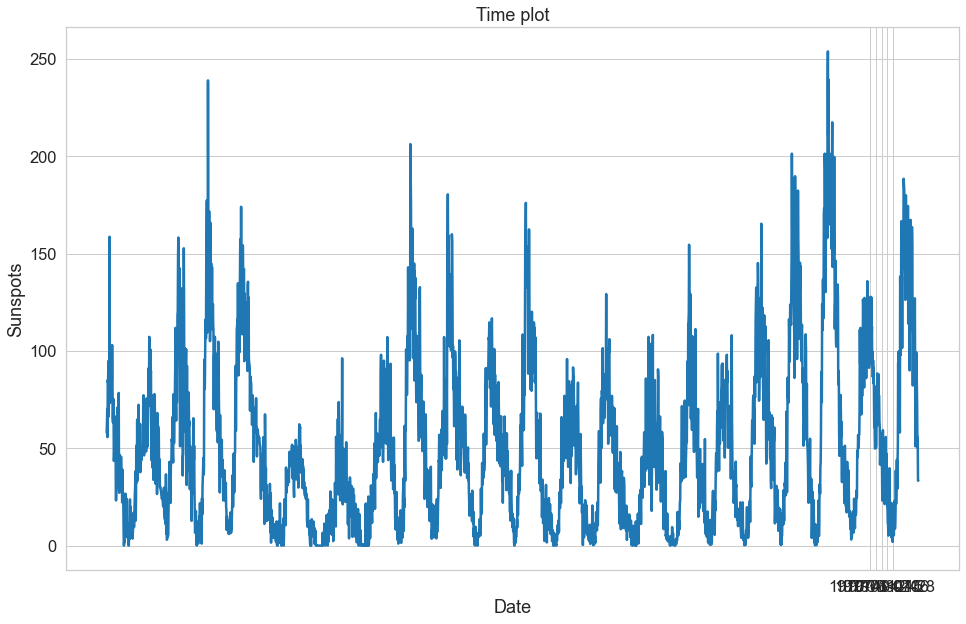
    


```python
#Downsampling Data
df_anual = df_date.copy()
df_anual.set_index('Date',inplace=True)

resample = df_anual.Sunspots.resample('1Y')
anual_mean = resample.mean()
anual_mean = anual_mean.to_frame()
anual_mean.reset_index(inplace=True)

fig, axes = plt.subplots(2,1, figsize=(15, 20))
plt.figure(figsize=(16, 10))
sns.set_style("whitegrid")
sns.set_context("notebook", font_scale=1.5, rc={"lines.linewidth": 2.5})

plt.figure(figsize=(16, 10))
ax = sns.lineplot(ax=axes[0],data=anual_mean,x='Date',y='Sunspots')
axes[0].set(xlabel='Date', ylabel = 'Sunspots')
axes[0].set_title('Time plot')
#ax.set_xticks(np.arange(7, 235 + 1, 10))
#ax.set_xlim(0,235)

data1=anual_mean.iloc[30:61,1].reset_index()

plt.figure(figsize=(16, 10))
bx = sns.lineplot(ax=axes[1],data=anual_mean.iloc[30:71,1].reset_index(drop=True))
cx = sns.lineplot(ax=axes[1],data=anual_mean.iloc[100:141,1].reset_index(drop=True))
dx = sns.lineplot(ax=axes[1],data=anual_mean.iloc[160:201,1].reset_index(drop=True))
axes[1].set(ylabel = 'Sunspots')
axes[1].set_title('Time plot')
axes[1].set_xlim(0,30)
axes[1].set_xticks(np.arange(0, 30 + 1, 1))

plt.show()
```


    
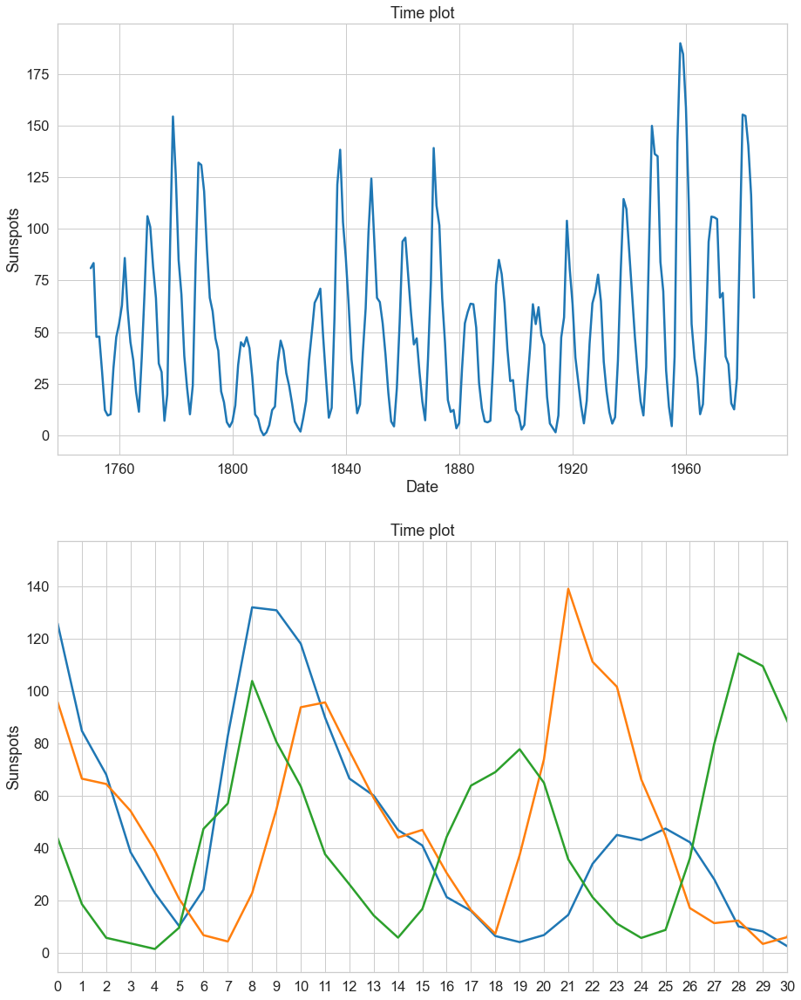
    


    <Figure size 1152x720 with 0 Axes>


    <Figure size 1152x720 with 0 Axes>


    <Figure size 1152x720 with 0 Axes>


```python
df_seasonal = pd.DataFrame(columns=['season',0,1,2,3,4,5,6,7,8,9,10],index=np.arange(1, 24))
for i in range(21):
    df_seasonal.iloc[i,0] = 1749 + 11*i
    for j in range(11):
        n = 11*i+j+1
        k = j+1
        df_seasonal.iloc[i,k] = anual_mean.iloc[n,1]
df_seasonal.set_index('season',inplace=True)
df_seasonal.head()
```


<div>
<style scoped>
    .dataframe tbody tr th:only-of-type {
        vertical-align: middle;
    }

    .dataframe tbody tr th {
        vertical-align: top;
    }

    .dataframe thead th {
        text-align: right;
    }
</style>
<table border="1" class="dataframe">
  <thead>
    <tr style="text-align: right;">
      <th></th>
      <th>0</th>
      <th>1</th>
      <th>2</th>
      <th>3</th>
      <th>4</th>
      <th>5</th>
      <th>6</th>
      <th>7</th>
      <th>8</th>
      <th>9</th>
      <th>10</th>
    </tr>
    <tr>
      <th>season</th>
      <th></th>
      <th></th>
      <th></th>
      <th></th>
      <th></th>
      <th></th>
      <th></th>
      <th></th>
      <th></th>
      <th></th>
      <th></th>
    </tr>
  </thead>
  <tbody>
    <tr>
      <th>1749.0</th>
      <td>83.3917</td>
      <td>47.6583</td>
      <td>47.8</td>
      <td>30.6917</td>
      <td>12.2167</td>
      <td>9.56667</td>
      <td>10.1917</td>
      <td>32.425</td>
      <td>47.6</td>
      <td>53.9667</td>
      <td>62.8583</td>
    </tr>
    <tr>
      <th>1760.0</th>
      <td>85.85</td>
      <td>61.15</td>
      <td>45.1167</td>
      <td>36.35</td>
      <td>20.9083</td>
      <td>11.4083</td>
      <td>37.825</td>
      <td>69.8417</td>
      <td>106.092</td>
      <td>100.8</td>
      <td>81.5833</td>
    </tr>
    <tr>
      <th>1771.0</th>
      <td>66.4917</td>
      <td>34.775</td>
      <td>30.6167</td>
      <td>7.00833</td>
      <td>19.8167</td>
      <td>92.5</td>
      <td>154.367</td>
      <td>125.925</td>
      <td>84.8</td>
      <td>68.0917</td>
      <td>38.4583</td>
    </tr>
    <tr>
      <th>1782.0</th>
      <td>22.8</td>
      <td>10.1667</td>
      <td>24.1</td>
      <td>82.8667</td>
      <td>132.025</td>
      <td>130.908</td>
      <td>118.108</td>
      <td>89.8917</td>
      <td>66.5833</td>
      <td>60.0417</td>
      <td>46.9</td>
    </tr>
    <tr>
      <th>1793.0</th>
      <td>41</td>
      <td>21.2667</td>
      <td>16.0167</td>
      <td>6.39167</td>
      <td>4.06667</td>
      <td>6.75833</td>
      <td>14.475</td>
      <td>34</td>
      <td>45.0333</td>
      <td>43.05</td>
      <td>47.4667</td>
    </tr>
  </tbody>
</table>
</div>


```python
seasonal_plot = df_seasonal.astype(float).copy().transpose()
plt.figure(figsize=(16, 10))
sns.set_style("whitegrid")
sns.set_context("notebook", font_scale=1.5, rc={"lines.linewidth": 2.5})
ax = sns.lineplot(data=seasonal_plot)
ax.set(xlabel='Year', ylabel = 'Sunspots')
ax.set_title('Seasonal plot')
ax.set_xlim(1,10)
ax.set_xticks(np.arange(1, 12 + 1, 1))
plt.show()
```


    
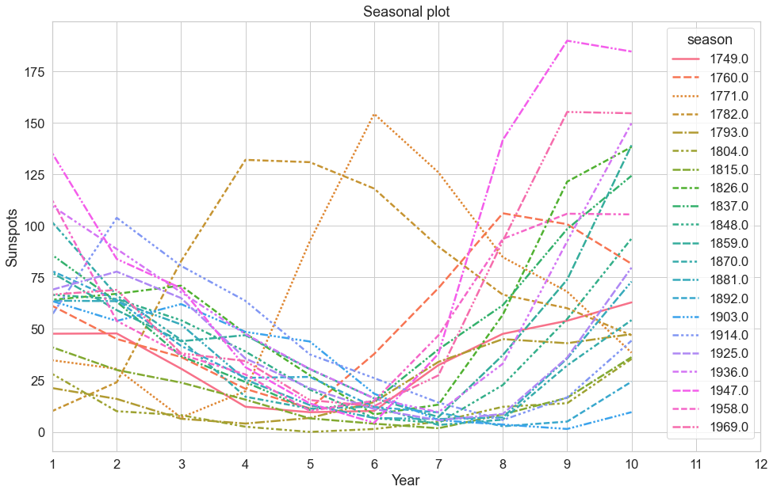
    


```python
import plotly.graph_objects as go


categories = list(df_seasonal.columns)
categories = [*categories, categories[0]]
categories = [str(i) for i in categories]

decade={}


for i in range(21):
    decade[i] = list(df_seasonal.iloc[i,:])
    decade[i] = [*decade[i], decade[i][0]]  
#print(categories)
#print(year_1)

fig = go.Figure(
    data=[
        go.Scatterpolar(r=decade[0], theta=categories, name='1749'),
        go.Scatterpolar(r=decade[1], theta=categories, name='1760'),
        go.Scatterpolar(r=decade[2], theta=categories, name='1771'),
        go.Scatterpolar(r=decade[3], theta=categories, name='1782'),
        go.Scatterpolar(r=decade[4], theta=categories, name='1793'),
        go.Scatterpolar(r=decade[5], theta=categories, name='1804'),
        go.Scatterpolar(r=decade[6], theta=categories, name='1815'),
        go.Scatterpolar(r=decade[7], theta=categories, name='1826'),
        go.Scatterpolar(r=decade[8], theta=categories, name='1837'),
        go.Scatterpolar(r=decade[9], theta=categories, name='1848'),
        go.Scatterpolar(r=decade[10], theta=categories, name='1859'),
        go.Scatterpolar(r=decade[11], theta=categories, name='1870'),
        go.Scatterpolar(r=decade[12], theta=categories, name='1881'),
        go.Scatterpolar(r=decade[13], theta=categories, name='1892'),
        go.Scatterpolar(r=decade[14], theta=categories, name='1903'),
        go.Scatterpolar(r=decade[15], theta=categories, name='1914'),
        go.Scatterpolar(r=decade[16], theta=categories, name='1925'),
        go.Scatterpolar(r=decade[17], theta=categories, name='1936'),
        go.Scatterpolar(r=decade[18], theta=categories, name='1947'),
        go.Scatterpolar(r=decade[19], theta=categories, name='1958'),
        go.Scatterpolar(r=decade[20], theta=categories, name='1969')
    ],
    layout=go.Layout(
       title=go.layout.Title(text='Polar seasonal plot'),
        polar={'radialaxis': {'visible': True},'bgcolor':'PapayaWhip'},
        showlegend=True,
        width=750,
        height=750,
        font=dict(
        size=18,
        )
    )
)

fig.show()
```


<div>                            <div id="cb399c91-2b80-46db-90cb-4216307ce10f" class="plotly-graph-div" style="height:750px; width:750px;"></div>            <script type="text/javascript">                require(["plotly"], function(Plotly) {                    window.PLOTLYENV=window.PLOTLYENV || {};                                    if (document.getElementById("cb399c91-2b80-46db-90cb-4216307ce10f")) {                    Plotly.newPlot(                        "cb399c91-2b80-46db-90cb-4216307ce10f",                        [{"name": "1749", "r": [83.39166666666667, 47.65833333333334, 47.800000000000004, 30.691666666666663, 12.216666666666663, 9.566666666666668, 10.191666666666666, 32.425, 47.599999999999994, 53.96666666666667, 62.85833333333334, 83.39166666666667], "theta": ["0", "1", "2", "3", "4", "5", "6", "7", "8", "9", "10", "0"], "type": "scatterpolar"}, {"name": "1760", "r": [85.85000000000002, 61.15, 45.11666666666667, 36.35, 20.90833333333333, 11.408333333333331, 37.825, 69.84166666666665, 106.09166666666665, 100.8, 81.58333333333334, 85.85000000000002], "theta": ["0", "1", "2", "3", "4", "5", "6", "7", "8", "9", "10", "0"], "type": "scatterpolar"}, {"name": "1771", "r": [66.49166666666666, 34.775, 30.616666666666664, 7.008333333333334, 19.816666666666666, 92.5, 154.36666666666665, 125.925, 84.80000000000001, 68.09166666666665, 38.458333333333336, 66.49166666666666], "theta": ["0", "1", "2", "3", "4", "5", "6", "7", "8", "9", "10", "0"], "type": "scatterpolar"}, {"name": "1782", "r": [22.799999999999997, 10.166666666666666, 24.099999999999998, 82.86666666666666, 132.025, 130.90833333333333, 118.10833333333333, 89.89166666666665, 66.58333333333333, 60.041666666666664, 46.900000000000006, 22.799999999999997], "theta": ["0", "1", "2", "3", "4", "5", "6", "7", "8", "9", "10", "0"], "type": "scatterpolar"}, {"name": "1793", "r": [41.0, 21.266666666666666, 16.01666666666667, 6.391666666666667, 4.066666666666666, 6.758333333333333, 14.475, 34.0, 45.03333333333334, 43.05000000000001, 47.46666666666667, 41.0], "theta": ["0", "1", "2", "3", "4", "5", "6", "7", "8", "9", "10", "0"], "type": "scatterpolar"}, {"name": "1804", "r": [42.24166666666667, 28.108333333333334, 10.049999999999999, 8.141666666666667, 2.5333333333333328, 0.0, 1.4166666666666667, 4.95, 12.191666666666668, 13.933333333333332, 35.4, 42.24166666666667], "theta": ["0", "1", "2", "3", "4", "5", "6", "7", "8", "9", "10", "0"], "type": "scatterpolar"}, {"name": "1815", "r": [45.80833333333334, 41.05833333333333, 30.058333333333334, 23.941666666666674, 15.674999999999997, 6.591666666666668, 4.0, 1.7916666666666667, 8.541666666666666, 16.566666666666666, 36.275, 45.80833333333334], "theta": ["0", "1", "2", "3", "4", "5", "6", "7", "8", "9", "10", "0"], "type": "scatterpolar"}, {"name": "1826", "r": [49.708333333333336, 64.15, 67.025, 70.98333333333333, 47.80833333333333, 27.525000000000002, 8.525, 13.241666666666665, 56.85833333333333, 121.45, 138.275, 49.708333333333336], "theta": ["0", "1", "2", "3", "4", "5", "6", "7", "8", "9", "10", "0"], "type": "scatterpolar"}, {"name": "1837", "r": [103.15000000000002, 85.81666666666666, 63.19166666666666, 36.800000000000004, 24.191666666666666, 10.674999999999999, 15.0, 40.05833333333333, 61.49999999999999, 98.45833333333331, 124.31666666666666, 103.15000000000002], "theta": ["0", "1", "2", "3", "4", "5", "6", "7", "8", "9", "10", "0"], "type": "scatterpolar"}, {"name": "1848", "r": [95.86666666666667, 66.53333333333335, 64.5, 54.20833333333332, 39.025, 20.566666666666666, 6.708333333333332, 4.3, 22.775000000000002, 54.80833333333334, 93.83333333333333, 95.86666666666667], "theta": ["0", "1", "2", "3", "4", "5", "6", "7", "8", "9", "10", "0"], "type": "scatterpolar"}, {"name": "1859", "r": [95.69166666666666, 77.16666666666667, 59.10833333333333, 44.01666666666667, 46.949999999999996, 30.47500000000001, 16.291666666666668, 7.258333333333333, 37.291666666666664, 73.89999999999999, 139.10833333333335, 95.69166666666666], "theta": ["0", "1", "2", "3", "4", "5", "6", "7", "8", "9", "10", "0"], "type": "scatterpolar"}, {"name": "1870", "r": [111.2, 101.66666666666667, 66.29166666666667, 44.65, 17.075, 11.316666666666665, 12.275, 3.3750000000000004, 5.958333333333335, 32.266666666666666, 54.25, 111.2], "theta": ["0", "1", "2", "3", "4", "5", "6", "7", "8", "9", "10", "0"], "type": "scatterpolar"}, {"name": "1881", "r": [59.65, 63.699999999999996, 63.44999999999999, 52.15833333333333, 25.375, 13.049999999999999, 6.75, 6.266666666666666, 7.05, 35.625, 72.96666666666665, 59.65], "theta": ["0", "1", "2", "3", "4", "5", "6", "7", "8", "9", "10", "0"], "type": "scatterpolar"}, {"name": "1892", "r": [84.93333333333332, 78.00833333333334, 63.966666666666676, 41.78333333333333, 26.24166666666667, 26.716666666666665, 12.108333333333334, 9.458333333333332, 2.7416666666666667, 5.025, 24.383333333333336, 84.93333333333332], "theta": ["0", "1", "2", "3", "4", "5", "6", "7", "8", "9", "10", "0"], "type": "scatterpolar"}, {"name": "1903", "r": [41.95, 63.466666666666676, 53.85833333333333, 62.03333333333333, 48.541666666666664, 43.88333333333335, 18.583333333333336, 5.7, 3.591666666666667, 1.4416666666666664, 9.591666666666667, 41.95], "theta": ["0", "1", "2", "3", "4", "5", "6", "7", "8", "9", "10", "0"], "type": "scatterpolar"}, {"name": "1914", "r": [47.36666666666667, 57.06666666666667, 103.89166666666667, 80.575, 63.60833333333333, 37.641666666666666, 26.133333333333336, 14.241666666666665, 5.7749999999999995, 16.716666666666665, 44.30833333333334, 47.36666666666667], "theta": ["0", "1", "2", "3", "4", "5", "6", "7", "8", "9", "10", "0"], "type": "scatterpolar"}, {"name": "1925", "r": [63.89166666666667, 69.04166666666667, 77.79166666666666, 64.96666666666667, 35.666666666666664, 21.225, 11.141666666666666, 5.658333333333332, 8.716666666666667, 36.05833333333333, 79.73333333333333, 63.89166666666667], "theta": ["0", "1", "2", "3", "4", "5", "6", "7", "8", "9", "10", "0"], "type": "scatterpolar"}, {"name": "1936", "r": [114.40000000000002, 109.55000000000001, 88.75, 67.78333333333332, 47.475, 30.599999999999998, 16.325, 9.591666666666667, 33.09166666666666, 92.50833333333333, 149.84166666666667, 114.40000000000002], "theta": ["0", "1", "2", "3", "4", "5", "6", "7", "8", "9", "10", "0"], "type": "scatterpolar"}, {"name": "1947", "r": [136.2, 135.11666666666665, 83.925, 69.75833333333334, 31.408333333333335, 13.85, 4.408333333333333, 37.949999999999996, 141.70833333333331, 189.85, 184.59166666666667, 136.2], "theta": ["0", "1", "2", "3", "4", "5", "6", "7", "8", "9", "10", "0"], "type": "scatterpolar"}, {"name": "1958", "r": [158.75, 112.27499999999999, 53.9, 37.6, 27.891666666666666, 10.199999999999998, 15.058333333333335, 46.87499999999999, 93.66666666666667, 105.89166666666665, 105.55833333333334, 158.75], "theta": ["0", "1", "2", "3", "4", "5", "6", "7", "8", "9", "10", "0"], "type": "scatterpolar"}, {"name": "1969", "r": [104.69166666666666, 66.65000000000002, 68.93333333333332, 38.15, 34.40833333333334, 15.458333333333336, 12.549999999999999, 27.483333333333334, 92.65833333333335, 155.275, 154.65, 104.69166666666666], "theta": ["0", "1", "2", "3", "4", "5", "6", "7", "8", "9", "10", "0"], "type": "scatterpolar"}],                        {"font": {"size": 18}, "height": 750, "polar": {"bgcolor": "PapayaWhip", "radialaxis": {"visible": true}}, "showlegend": true, "template": {"data": {"bar": [{"error_x": {"color": "#2a3f5f"}, "error_y": {"color": "#2a3f5f"}, "marker": {"line": {"color": "#E5ECF6", "width": 0.5}}, "type": "bar"}], "barpolar": [{"marker": {"line": {"color": "#E5ECF6", "width": 0.5}}, "type": "barpolar"}], "carpet": [{"aaxis": {"endlinecolor": "#2a3f5f", "gridcolor": "white", "linecolor": "white", "minorgridcolor": "white", "startlinecolor": "#2a3f5f"}, "baxis": {"endlinecolor": "#2a3f5f", "gridcolor": "white", "linecolor": "white", "minorgridcolor": "white", "startlinecolor": "#2a3f5f"}, "type": "carpet"}], "choropleth": [{"colorbar": {"outlinewidth": 0, "ticks": ""}, "type": "choropleth"}], "contour": [{"colorbar": {"outlinewidth": 0, "ticks": ""}, "colorscale": [[0.0, "#0d0887"], [0.1111111111111111, "#46039f"], [0.2222222222222222, "#7201a8"], [0.3333333333333333, "#9c179e"], [0.4444444444444444, "#bd3786"], [0.5555555555555556, "#d8576b"], [0.6666666666666666, "#ed7953"], [0.7777777777777778, "#fb9f3a"], [0.8888888888888888, "#fdca26"], [1.0, "#f0f921"]], "type": "contour"}], "contourcarpet": [{"colorbar": {"outlinewidth": 0, "ticks": ""}, "type": "contourcarpet"}], "heatmap": [{"colorbar": {"outlinewidth": 0, "ticks": ""}, "colorscale": [[0.0, "#0d0887"], [0.1111111111111111, "#46039f"], [0.2222222222222222, "#7201a8"], [0.3333333333333333, "#9c179e"], [0.4444444444444444, "#bd3786"], [0.5555555555555556, "#d8576b"], [0.6666666666666666, "#ed7953"], [0.7777777777777778, "#fb9f3a"], [0.8888888888888888, "#fdca26"], [1.0, "#f0f921"]], "type": "heatmap"}], "heatmapgl": [{"colorbar": {"outlinewidth": 0, "ticks": ""}, "colorscale": [[0.0, "#0d0887"], [0.1111111111111111, "#46039f"], [0.2222222222222222, "#7201a8"], [0.3333333333333333, "#9c179e"], [0.4444444444444444, "#bd3786"], [0.5555555555555556, "#d8576b"], [0.6666666666666666, "#ed7953"], [0.7777777777777778, "#fb9f3a"], [0.8888888888888888, "#fdca26"], [1.0, "#f0f921"]], "type": "heatmapgl"}], "histogram": [{"marker": {"colorbar": {"outlinewidth": 0, "ticks": ""}}, "type": "histogram"}], "histogram2d": [{"colorbar": {"outlinewidth": 0, "ticks": ""}, "colorscale": [[0.0, "#0d0887"], [0.1111111111111111, "#46039f"], [0.2222222222222222, "#7201a8"], [0.3333333333333333, "#9c179e"], [0.4444444444444444, "#bd3786"], [0.5555555555555556, "#d8576b"], [0.6666666666666666, "#ed7953"], [0.7777777777777778, "#fb9f3a"], [0.8888888888888888, "#fdca26"], [1.0, "#f0f921"]], "type": "histogram2d"}], "histogram2dcontour": [{"colorbar": {"outlinewidth": 0, "ticks": ""}, "colorscale": [[0.0, "#0d0887"], [0.1111111111111111, "#46039f"], [0.2222222222222222, "#7201a8"], [0.3333333333333333, "#9c179e"], [0.4444444444444444, "#bd3786"], [0.5555555555555556, "#d8576b"], [0.6666666666666666, "#ed7953"], [0.7777777777777778, "#fb9f3a"], [0.8888888888888888, "#fdca26"], [1.0, "#f0f921"]], "type": "histogram2dcontour"}], "mesh3d": [{"colorbar": {"outlinewidth": 0, "ticks": ""}, "type": "mesh3d"}], "parcoords": [{"line": {"colorbar": {"outlinewidth": 0, "ticks": ""}}, "type": "parcoords"}], "pie": [{"automargin": true, "type": "pie"}], "scatter": [{"marker": {"colorbar": {"outlinewidth": 0, "ticks": ""}}, "type": "scatter"}], "scatter3d": [{"line": {"colorbar": {"outlinewidth": 0, "ticks": ""}}, "marker": {"colorbar": {"outlinewidth": 0, "ticks": ""}}, "type": "scatter3d"}], "scattercarpet": [{"marker": {"colorbar": {"outlinewidth": 0, "ticks": ""}}, "type": "scattercarpet"}], "scattergeo": [{"marker": {"colorbar": {"outlinewidth": 0, "ticks": ""}}, "type": "scattergeo"}], "scattergl": [{"marker": {"colorbar": {"outlinewidth": 0, "ticks": ""}}, "type": "scattergl"}], "scattermapbox": [{"marker": {"colorbar": {"outlinewidth": 0, "ticks": ""}}, "type": "scattermapbox"}], "scatterpolar": [{"marker": {"colorbar": {"outlinewidth": 0, "ticks": ""}}, "type": "scatterpolar"}], "scatterpolargl": [{"marker": {"colorbar": {"outlinewidth": 0, "ticks": ""}}, "type": "scatterpolargl"}], "scatterternary": [{"marker": {"colorbar": {"outlinewidth": 0, "ticks": ""}}, "type": "scatterternary"}], "surface": [{"colorbar": {"outlinewidth": 0, "ticks": ""}, "colorscale": [[0.0, "#0d0887"], [0.1111111111111111, "#46039f"], [0.2222222222222222, "#7201a8"], [0.3333333333333333, "#9c179e"], [0.4444444444444444, "#bd3786"], [0.5555555555555556, "#d8576b"], [0.6666666666666666, "#ed7953"], [0.7777777777777778, "#fb9f3a"], [0.8888888888888888, "#fdca26"], [1.0, "#f0f921"]], "type": "surface"}], "table": [{"cells": {"fill": {"color": "#EBF0F8"}, "line": {"color": "white"}}, "header": {"fill": {"color": "#C8D4E3"}, "line": {"color": "white"}}, "type": "table"}]}, "layout": {"annotationdefaults": {"arrowcolor": "#2a3f5f", "arrowhead": 0, "arrowwidth": 1}, "autotypenumbers": "strict", "coloraxis": {"colorbar": {"outlinewidth": 0, "ticks": ""}}, "colorscale": {"diverging": [[0, "#8e0152"], [0.1, "#c51b7d"], [0.2, "#de77ae"], [0.3, "#f1b6da"], [0.4, "#fde0ef"], [0.5, "#f7f7f7"], [0.6, "#e6f5d0"], [0.7, "#b8e186"], [0.8, "#7fbc41"], [0.9, "#4d9221"], [1, "#276419"]], "sequential": [[0.0, "#0d0887"], [0.1111111111111111, "#46039f"], [0.2222222222222222, "#7201a8"], [0.3333333333333333, "#9c179e"], [0.4444444444444444, "#bd3786"], [0.5555555555555556, "#d8576b"], [0.6666666666666666, "#ed7953"], [0.7777777777777778, "#fb9f3a"], [0.8888888888888888, "#fdca26"], [1.0, "#f0f921"]], "sequentialminus": [[0.0, "#0d0887"], [0.1111111111111111, "#46039f"], [0.2222222222222222, "#7201a8"], [0.3333333333333333, "#9c179e"], [0.4444444444444444, "#bd3786"], [0.5555555555555556, "#d8576b"], [0.6666666666666666, "#ed7953"], [0.7777777777777778, "#fb9f3a"], [0.8888888888888888, "#fdca26"], [1.0, "#f0f921"]]}, "colorway": ["#636efa", "#EF553B", "#00cc96", "#ab63fa", "#FFA15A", "#19d3f3", "#FF6692", "#B6E880", "#FF97FF", "#FECB52"], "font": {"color": "#2a3f5f"}, "geo": {"bgcolor": "white", "lakecolor": "white", "landcolor": "#E5ECF6", "showlakes": true, "showland": true, "subunitcolor": "white"}, "hoverlabel": {"align": "left"}, "hovermode": "closest", "mapbox": {"style": "light"}, "paper_bgcolor": "white", "plot_bgcolor": "#E5ECF6", "polar": {"angularaxis": {"gridcolor": "white", "linecolor": "white", "ticks": ""}, "bgcolor": "#E5ECF6", "radialaxis": {"gridcolor": "white", "linecolor": "white", "ticks": ""}}, "scene": {"xaxis": {"backgroundcolor": "#E5ECF6", "gridcolor": "white", "gridwidth": 2, "linecolor": "white", "showbackground": true, "ticks": "", "zerolinecolor": "white"}, "yaxis": {"backgroundcolor": "#E5ECF6", "gridcolor": "white", "gridwidth": 2, "linecolor": "white", "showbackground": true, "ticks": "", "zerolinecolor": "white"}, "zaxis": {"backgroundcolor": "#E5ECF6", "gridcolor": "white", "gridwidth": 2, "linecolor": "white", "showbackground": true, "ticks": "", "zerolinecolor": "white"}}, "shapedefaults": {"line": {"color": "#2a3f5f"}}, "ternary": {"aaxis": {"gridcolor": "white", "linecolor": "white", "ticks": ""}, "baxis": {"gridcolor": "white", "linecolor": "white", "ticks": ""}, "bgcolor": "#E5ECF6", "caxis": {"gridcolor": "white", "linecolor": "white", "ticks": ""}}, "title": {"x": 0.05}, "xaxis": {"automargin": true, "gridcolor": "white", "linecolor": "white", "ticks": "", "title": {"standoff": 15}, "zerolinecolor": "white", "zerolinewidth": 2}, "yaxis": {"automargin": true, "gridcolor": "white", "linecolor": "white", "ticks": "", "title": {"standoff": 15}, "zerolinecolor": "white", "zerolinewidth": 2}}}, "title": {"text": "Polar seasonal plot"}, "width": 750},                        {"responsive": true}                    ).then(function(){

var gd = document.getElementById('cb399c91-2b80-46db-90cb-4216307ce10f');
var x = new MutationObserver(function (mutations, observer) {{
        var display = window.getComputedStyle(gd).display;
        if (!display || display === 'none') {{
            console.log([gd, 'removed!']);
            Plotly.purge(gd);
            observer.disconnect();
        }}
}});

// Listen for the removal of the full notebook cells
var notebookContainer = gd.closest('#notebook-container');
if (notebookContainer) {{
    x.observe(notebookContainer, {childList: true});
}}

// Listen for the clearing of the current output cell
var outputEl = gd.closest('.output');
if (outputEl) {{
    x.observe(outputEl, {childList: true});
}}

                        })                };                });            </script>        </div>


```python
fig_lag = plt.figure(figsize=(16, 8))
#fig, ax = plt.subplots(1, 2, figsize=(12, 7))
#ax[0].set_xlabel('Time')
#ax[0].set_ylabel('Amplitude')
#ax[0].axhline(y=0, color='k')
fig_lag.suptitle('Lag plot')
plt.subplot(121)
pd.plotting.lag_plot(df_date['Sunspots'], lag= 1)
plt.subplot(122)
pd.plotting.lag_plot(df_date['Sunspots'], lag= 12)
plt.show()
```


    
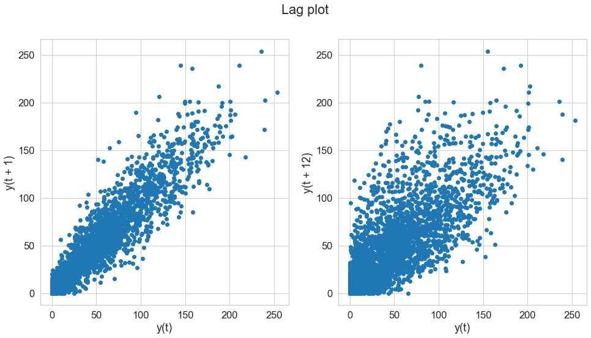
    


```python
from statsmodels.tsa.stattools import acf, pacf
from statsmodels.graphics.tsaplots import plot_acf, plot_pacf

# Calculate ACF and PACF upto 50 lags
# acf_50 = acf(df.value, nlags=50)
# pacf_50 = pacf(df.value, nlags=50)

# Draw Plot
fig_auto, axes = plt.subplots(2,1,figsize=(18,20), dpi= 100)
fig_auto.suptitle('ACF and PACF plots')
plot_acf(df_date['Sunspots'], lags=120, ax=axes[0])
axes[0].set_xlabel('Lag')
plot_pacf(df_date['Sunspots'], lags=70, ax=axes[1])
axes[1].set_xlabel('Lag')
plt.show()
```


    
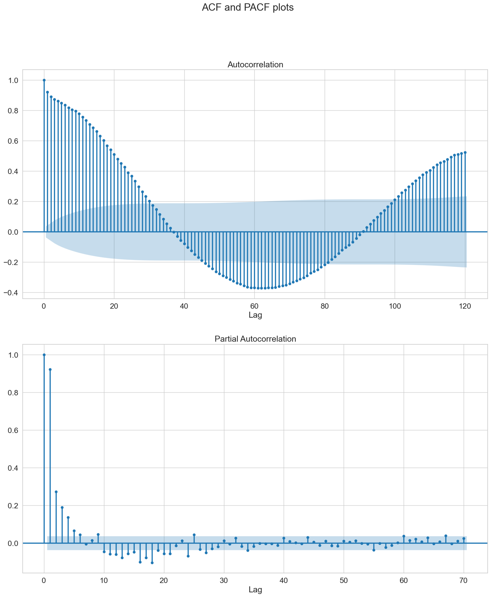
    


## 2. Data modelling

### Data analysis

The results of the exploratory analysis indicated that the time series is not stationary, i.e., its properties depend on the time at which the series is observed. Before continuing, let's check this using two tests: 

1. Augmented Dickey Fuller test - ADH Test
2. Kwiatkowski-Phillips-Schmidt-Shin test – KPSS test
3. Dickey-Fuller GLS test - DFGLS test
4. Phillips-Perron test - PHP test

In the ADF test, the null hypothesis is that the time series possesses a unit root and is non-stationary. So, if the p-value is less than the significance level (0.05), you reject the null hypothesis.

The KPSS test, on the other hand, is used to test for trend stationarity. The null hypothesis and the p-value interpretation is just the opposite of ADH test. So, the time series is stationary if the null hypothesis is valid (p-value > 0.05).

The DFGLS test is an improved version of the ADF which uses a GLS-detrending regression before running an ADF regression with no additional deterministic terms. The null hypothesis is the same as the ADF test.

The PHP test is similar to the ADF except that the regression run does not include lagged values of the first differences. Instead, the PP test fixed the t-statistic using a long run variance estimation, implemented using a Newey-West covariance estimator. The null hypothesis is that the time series possesses a unit root and is non-stationary. So, if the p-value is less than the significance level (0.05), the series is stationary.

Using the tests with the functions default lags values, all the results indicate that the time series is stationary, despite the obvious seasonal trend identified in the exploratory analysis. However, setting the lags for higher values, more compatible with the PACF plot, we verify that our data fail in some of the tests, **confirming that it is not stationary**. 

Therefore, we need to **extract the seasonal component** of our data before trying to create a forecasting model. The first step is to decompose the data in its components, S (seasonal component), T (trend-cycle component), and R (remainder component) (HYNDMAN; ATHANASOPOULOS, 2018; HOLMES; SCHEURELL; WARD, 2021). There are many different methods for decomposing data. There are the so called 'classical decomposition methods': the additive and multiplicative methods. Besides, there are more recent methods, such as X11, Seasonal Extraction in ARIMA Time Series (SEATS), and Seasonal and Trend decomposition using Loess (STS). The [statsmodels library](https://www.statsmodels.org/stable/index.html) provides many of these methods. Therfore, we can easily try more than one of them.

Both the classical decomposition methods confirm that the **data have a strong seasonal component**. Moreover, **there is also a weak seasonal component** that was not detected in the exploratory analysis. However, these are 'naive' decompositions, thus we should use a more versatile and robust method. 

Thus, we can use the STL method to check our previous results. We use two kinds of STL methods. In the first case, we activate the 'robust' feature, which uses a data-dependent weighting function that re-weights data when estimating the LOESS (and so is using LOWESS). **Using robust estimation allows the model to tolerate larger errors**. In the second case, we do not activate the robust feature. Besides, we use the decomposed components to measure the strenght of trend and seasonality in the time series. In this case, the closer Ft and Fs are to 1, the higher is the strenght.

The results from both methods show that **there is a strong seasonal component** in the data. However, the robust STL indicate that the seasonal component is not so relevant, while the non-robust STL result indicates the contrary.

We need to remove the trend and the seasonality to use be able to use the data to make forecasts. 

We will test two methods see which of them return the more stationary time series. 

First, we use differencing, i.e., compute the differences between consecutive observations. "Differencing can help stabilise the mean of a time series by removing changes in the level of a time series, and therefore eliminating (or reducing) trend and seasonality" (HYNDMAN; ATHANASOPOULOS, 2018). **After differencing the time series, the result of the ADF and the KPSS testes show that the resulting time series is still not stationary**. 

Second, we try to remove the trend using a model fitting. "Linear trends can be summarized by a linear model, and nonlinear trends may be best summarized using a polynomial or other curve-fitting method [...] In addition to being used as a trend identification tool, these fit models can also be used to detrend a time series" (BROWNLEE, 2020). **However, after fitting the the time series, stationatity is not confirmed in the tests**. This is probably due to the seasonal component we identified earlier. 

Therefore, we need to use a specific method to deal with the seasonality. **We may try first a seasonal differencing**. Then, if necessary, we can also apply the model fitting or another differencing to the deseazonalized data. **This is not necessary because the resulting deseasonalized time seris passes all tests**. Besides, we verified that the best results are achieved considering a period of 11 years for a season, instead of the 10 years we were considering before.

----------


```python
!pip install arch
```

    Requirement already satisfied: arch in /Users/leuzinger/opt/anaconda3/lib/python3.8/site-packages (4.19)
    Requirement already satisfied: property-cached>=1.6.4 in /Users/leuzinger/opt/anaconda3/lib/python3.8/site-packages (from arch) (1.6.4)
    Requirement already satisfied: cython>=0.29.14 in /Users/leuzinger/opt/anaconda3/lib/python3.8/site-packages (from arch) (0.29.21)
    Requirement already satisfied: pandas>=0.23 in /Users/leuzinger/opt/anaconda3/lib/python3.8/site-packages (from arch) (1.1.3)
    Requirement already satisfied: scipy>=1.2.3 in /Users/leuzinger/opt/anaconda3/lib/python3.8/site-packages (from arch) (1.5.2)
    Requirement already satisfied: statsmodels>=0.10 in /Users/leuzinger/opt/anaconda3/lib/python3.8/site-packages (from arch) (0.12.2)
    Requirement already satisfied: numpy>=1.14 in /Users/leuzinger/opt/anaconda3/lib/python3.8/site-packages (from arch) (1.19.2)
    Requirement already satisfied: pytz>=2017.2 in /Users/leuzinger/opt/anaconda3/lib/python3.8/site-packages (from pandas>=0.23->arch) (2020.1)
    Requirement already satisfied: python-dateutil>=2.7.3 in /Users/leuzinger/opt/anaconda3/lib/python3.8/site-packages (from pandas>=0.23->arch) (2.8.1)
    Requirement already satisfied: patsy>=0.5 in /Users/leuzinger/opt/anaconda3/lib/python3.8/site-packages (from statsmodels>=0.10->arch) (0.5.1)
    Requirement already satisfied: six>=1.5 in /Users/leuzinger/opt/anaconda3/lib/python3.8/site-packages (from python-dateutil>=2.7.3->pandas>=0.23->arch) (1.15.0)


```python
from arch.unitroot import PhillipsPerron, ADF, DFGLS, KPSS

print(PhillipsPerron(df_date['Sunspots']))
print('\n',DFGLS(df_date['Sunspots']))
print('\n',ADF(df_date['Sunspots']))
print('\n',KPSS(df_date['Sunspots']))
```

         Phillips-Perron Test (Z-tau)    
    =====================================
    Test Statistic                -11.727
    P-value                         0.000
    Lags                               28
    -------------------------------------
    
    Trend: Constant
    Critical Values: -3.43 (1%), -2.86 (5%), -2.57 (10%)
    Null Hypothesis: The process contains a unit root.
    Alternative Hypothesis: The process is weakly stationary.
    
           Dickey-Fuller GLS Results      
    =====================================
    Test Statistic                 -9.355
    P-value                         0.000
    Lags                               27
    -------------------------------------
    
    Trend: Constant
    Critical Values: -2.58 (1%), -1.95 (5%), -1.63 (10%)
    Null Hypothesis: The process contains a unit root.
    Alternative Hypothesis: The process is weakly stationary.
    
        Augmented Dickey-Fuller Results   
    =====================================
    Test Statistic                 -9.568
    P-value                         0.000
    Lags                               27
    -------------------------------------
    
    Trend: Constant
    Critical Values: -3.43 (1%), -2.86 (5%), -2.57 (10%)
    Null Hypothesis: The process contains a unit root.
    Alternative Hypothesis: The process is weakly stationary.
    
         KPSS Stationarity Test Results   
    =====================================
    Test Statistic                  0.441
    P-value                         0.056
    Lags                               31
    -------------------------------------
    
    Trend: Constant
    Critical Values: 0.74 (1%), 0.46 (5%), 0.35 (10%)
    Null Hypothesis: The process is weakly stationary.
    Alternative Hypothesis: The process contains a unit root.


```python
print(PhillipsPerron(df_date['Sunspots'],lags=120))
print('\n',DFGLS(df_date['Sunspots'],lags=120))
print('\n',ADF(df_date['Sunspots'],lags=120))
print('\n',KPSS(df_date['Sunspots'],lags=120))
```

         Phillips-Perron Test (Z-tau)    
    =====================================
    Test Statistic                -10.773
    P-value                         0.000
    Lags                              120
    -------------------------------------
    
    Trend: Constant
    Critical Values: -3.43 (1%), -2.86 (5%), -2.57 (10%)
    Null Hypothesis: The process contains a unit root.
    Alternative Hypothesis: The process is weakly stationary.
    
           Dickey-Fuller GLS Results      
    =====================================
    Test Statistic                 -2.302
    P-value                         0.021
    Lags                              120
    -------------------------------------
    
    Trend: Constant
    Critical Values: -2.58 (1%), -1.95 (5%), -1.63 (10%)
    Null Hypothesis: The process contains a unit root.
    Alternative Hypothesis: The process is weakly stationary.
    
        Augmented Dickey-Fuller Results   
    =====================================
    Test Statistic                 -2.315
    P-value                         0.167
    Lags                              120
    -------------------------------------
    
    Trend: Constant
    Critical Values: -3.43 (1%), -2.86 (5%), -2.57 (10%)
    Null Hypothesis: The process contains a unit root.
    Alternative Hypothesis: The process is weakly stationary.
    
         KPSS Stationarity Test Results   
    =====================================
    Test Statistic                  0.431
    P-value                         0.060
    Lags                              120
    -------------------------------------
    
    Trend: Constant
    Critical Values: 0.74 (1%), 0.46 (5%), 0.35 (10%)
    Null Hypothesis: The process is weakly stationary.
    Alternative Hypothesis: The process contains a unit root.


```python
from statsmodels.tsa.seasonal import seasonal_decompose


'''df_decompose = df_date.copy()
df_decompose['Date'] = pd.to_datetime(df_date['Date'])
df_decompose.set_index('Date',inplace=True)'''

# Decomposition is  Multiplicative
#multiplicative = seasonal_decompose(df_anual['Sunspots'], model='multiplicative')

#adopting the period fo 10 years = 120 months
# Decomposition is  Additive
additive = seasonal_decompose(df_anual['Sunspots'], model='additive',period=132)

# Plotting
plt.rcParams.update({'figure.figsize': (12,12)})
#multiplicative.plot().suptitle('Multiplicative Decompose', x=0.55,y=1.01,fontsize=22)
additive.plot().suptitle('Additive Decompose', x=0.55,y=1.01, fontsize=22)
plt.show()
```


    
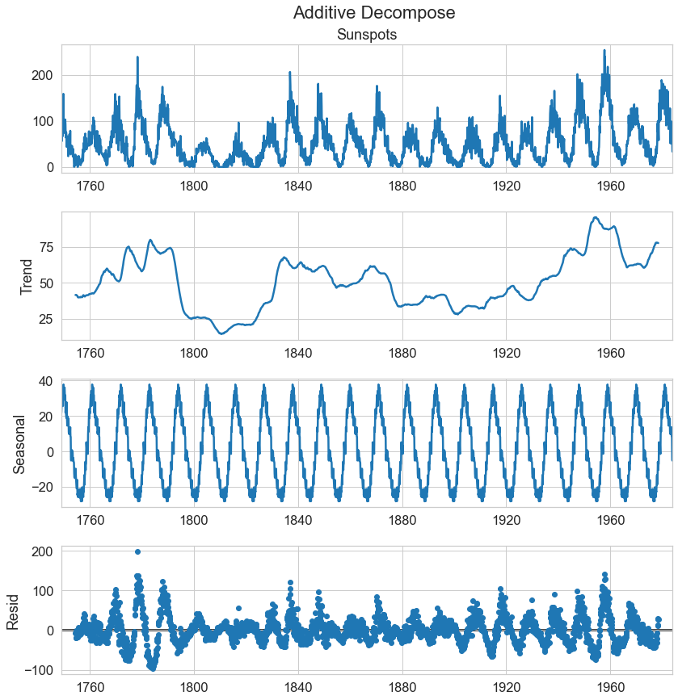
    


```python
from statsmodels.tsa.seasonal import STL

def add_stl_plot(fig, res, legend):
    """Add 3 plots from a second STL fit"""
    axs = fig.get_axes()
    comps = ['trend', 'seasonal', 'resid']
    for ax, comp in zip(axs[1:], comps):
        series = getattr(res, comp)
        if comp == 'resid':
            ax.plot(series, marker='o', linestyle='none')
        else:
            ax.plot(series)
            if comp == 'trend':
                ax.legend(legend, frameon=False)

#adopting the period fo 10 years = 120 months
stl_R = STL(df_anual['Sunspots'],period=120,robust=True)
res_R = stl_R.fit()
fig = res_R.plot()
stl_nR = STL(df_anual['Sunspots'],period=120,robust=False)
res_nR = stl_nR.fit()
add_stl_plot(fig, res_nR, ['Robust','Non-robust'])
```


    
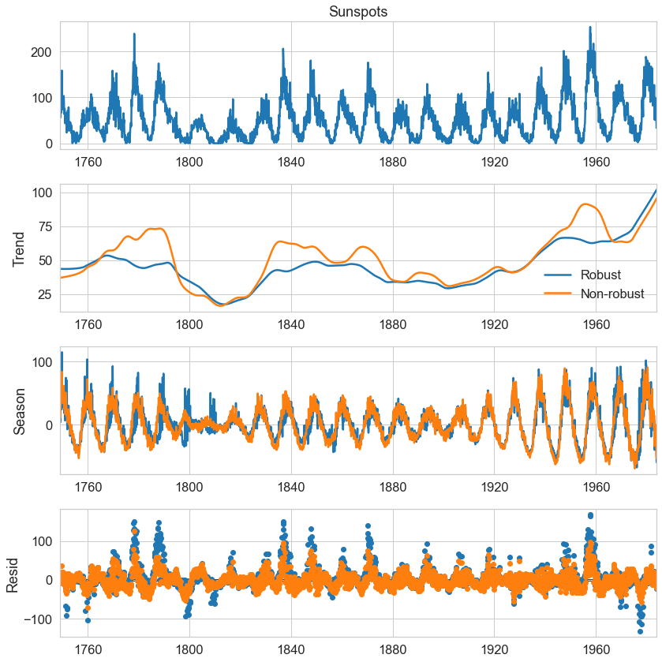
    


```python
from statistics import variance

# Extract the Components
# Actual Values = Product of (Seasonal * Trend * Resid)
df_reconstructed_stl = pd.concat([res_R.seasonal, res_R.trend, res_R.resid, res_R.observed], axis=1)
df_reconstructed_stl.columns = ['season', 'trend', 'residual', 'actual_values']
print(df_reconstructed_stl.head())

#calculate the strenght of the trend component
T_R = df_reconstructed_stl['trend']+df_reconstructed_stl['residual']
Ft = max((0,1-variance(df_reconstructed_stl['residual'])/variance(T_R)))
print('\nStrength of the trend component:%0.3f'%Ft)

#calculate the strenght of the seasonal component
S_R = df_reconstructed_stl['season']+df_reconstructed_stl['residual']
Fs = max((0,1-variance(df_reconstructed_stl['residual'])/variance(S_R)))
print('Strength of the seasonal component:%0.3f'%Fs)
```

                   season      trend   residual  actual_values
    Date                                                      
    1749-01-01   2.394908  43.521513  12.083579           58.0
    1749-02-01  16.056623  43.514323   3.029054           62.6
    1749-03-01  21.635553  43.507416   4.857032           70.0
    1749-04-01   3.759767  43.500794   8.439438           55.7
    1749-05-01  35.377636  43.494461   6.127902           85.0
    
    Strength of the trend component:0.251
    Strength of the seasonal component:0.503


```python
# Extract the Components
# Actual Values = Product of (Seasonal * Trend * Resid)
df_reconstructed_stlnR = pd.concat([res_nR.seasonal, res_nR.trend, res_nR.resid, res_nR.observed], axis=1)
df_reconstructed_stlnR.columns = ['season', 'trend', 'residual', 'actual_values']
print(df_reconstructed_stlnR.head())

#calculate the strenght of the trend component
T_R1 = df_reconstructed_stlnR['trend']+df_reconstructed_stlnR['residual']
Ft1 = max((0,1-variance(df_reconstructed_stlnR['residual'])/variance(T_R1)))
print('\nStrength of the trend component:%0.3f'%Ft1)

#calculate the strenght of the seasonal component
S_R1 = df_reconstructed_stlnR['season']+df_reconstructed_stlnR['residual']
Fs1 = max((0,1-variance(df_reconstructed_stlnR['residual'])/variance(S_R1)))
print('Strength of the seasonal component:%0.3f'%Fs1)
```

                   season      trend   residual  actual_values
    Date                                                      
    1749-01-01  13.191779  36.951112   7.857108           58.0
    1749-02-01   9.352736  36.970551  16.276713           62.6
    1749-03-01  17.009278  36.990368  16.000354           70.0
    1749-04-01  12.164887  37.010569   6.524543           55.7
    1749-05-01  27.896308  37.031156  20.072535           85.0
    
    Strength of the trend component:0.492
    Strength of the seasonal component:0.732


```python
'''from scipy import stats

df_transf = df_date.copy()
fitted_data, fitted_lambda = stats.boxcox(df_date['Sales'])
print('Lambda = %0.3f' % fitted_lambda)
df_transf['Sales_fit'] = fitted_data

ax = df_transf['Sales_fit'].plot(figsize=(12,8))
ax.set(xlabel='Month', ylabel = 'Sales')
ax.set_title('Transformed time series')
plt.show()'''
```


```python
#differencing the time series to remove trend
df_diff = df_date.copy()

df_diff['Sunspots_diff'] = df_diff['Sunspots'] - df_diff['Sunspots'].shift(1)
df_diff.dropna(inplace=True)

ax = df_diff['Sunspots_diff'].plot(figsize=(12,8))
ax.set(xlabel='Month', ylabel = 'Sunspots')
ax.set_title('Differentiated time series')
plt.show()
```


    
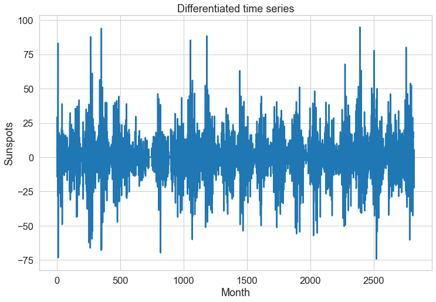
    


```python
print(PhillipsPerron(df_diff['Sunspots'],lags=120))
print('\n',DFGLS(df_diff['Sunspots'],lags=120))
print('\n',ADF(df_diff['Sunspots'],lags=120))
print('\n',KPSS(df_diff['Sunspots'],lags=120))
```

         Phillips-Perron Test (Z-tau)    
    =====================================
    Test Statistic                -10.775
    P-value                         0.000
    Lags                              120
    -------------------------------------
    
    Trend: Constant
    Critical Values: -3.43 (1%), -2.86 (5%), -2.57 (10%)
    Null Hypothesis: The process contains a unit root.
    Alternative Hypothesis: The process is weakly stationary.
    
           Dickey-Fuller GLS Results      
    =====================================
    Test Statistic                 -2.182
    P-value                         0.029
    Lags                              120
    -------------------------------------
    
    Trend: Constant
    Critical Values: -2.58 (1%), -1.95 (5%), -1.63 (10%)
    Null Hypothesis: The process contains a unit root.
    Alternative Hypothesis: The process is weakly stationary.
    
        Augmented Dickey-Fuller Results   
    =====================================
    Test Statistic                 -2.325
    P-value                         0.164
    Lags                              120
    -------------------------------------
    
    Trend: Constant
    Critical Values: -3.43 (1%), -2.86 (5%), -2.57 (10%)
    Null Hypothesis: The process contains a unit root.
    Alternative Hypothesis: The process is weakly stationary.
    
         KPSS Stationarity Test Results   
    =====================================
    Test Statistic                  0.431
    P-value                         0.060
    Lags                              120
    -------------------------------------
    
    Trend: Constant
    Critical Values: 0.74 (1%), 0.46 (5%), 0.35 (10%)
    Null Hypothesis: The process is weakly stationary.
    Alternative Hypothesis: The process contains a unit root.


```python
# use a linear model to detrend a time series
from sklearn.linear_model import LinearRegression

df_reg = df_date.copy()
X = [i for i in range(0, len(df_reg['Sunspots']))]
X = np.reshape(X, (len(X), 1))
y = df_reg['Sunspots'].values
model = LinearRegression()
model.fit(X, y)

# calculate trend
trend = model.predict(X)

# plot trend
plt.plot(y)
plt.plot(trend)
plt.title('Sunspots dataset plot with trend')
plt.xlabel('Year')
plt.ylabel('Sunspots')
plt.show()

# detrend
detrended = [y[i]-trend[i] for i in range(0, len(df_reg['Sunspots']))]

# plot detrended
plt.plot(detrended)
plt.title('Detrended time series')
plt.xlabel('Month')
plt.ylabel('Sunspots')
plt.show()
```


    
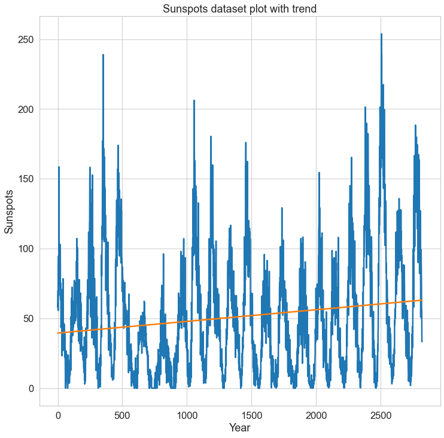
    


    
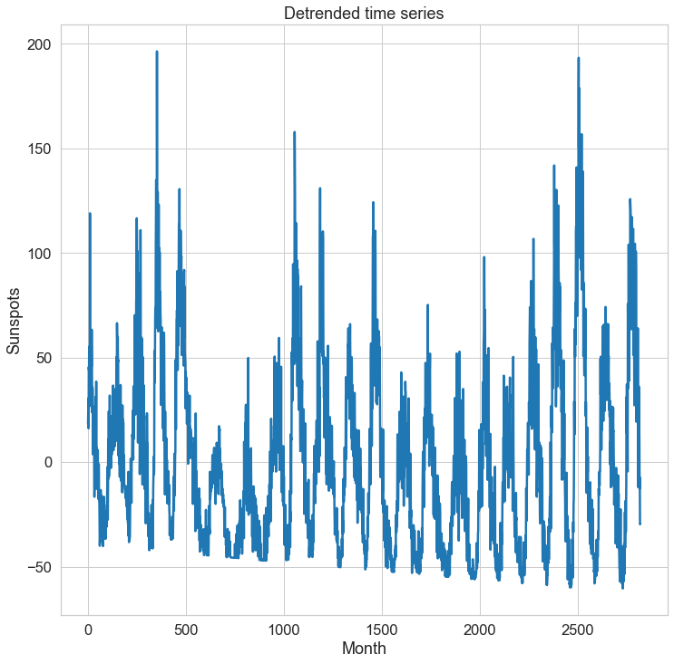
    


```python
print(PhillipsPerron(df_reg['Sunspots'],lags=120))
print('\n',DFGLS(df_reg['Sunspots'],lags=120))
print('\n',ADF(df_reg['Sunspots'],lags=120))
print('\n',KPSS(df_reg['Sunspots'],lags=120))
```

         Phillips-Perron Test (Z-tau)    
    =====================================
    Test Statistic                -10.773
    P-value                         0.000
    Lags                              120
    -------------------------------------
    
    Trend: Constant
    Critical Values: -3.43 (1%), -2.86 (5%), -2.57 (10%)
    Null Hypothesis: The process contains a unit root.
    Alternative Hypothesis: The process is weakly stationary.
    
           Dickey-Fuller GLS Results      
    =====================================
    Test Statistic                 -2.302
    P-value                         0.021
    Lags                              120
    -------------------------------------
    
    Trend: Constant
    Critical Values: -2.58 (1%), -1.95 (5%), -1.63 (10%)
    Null Hypothesis: The process contains a unit root.
    Alternative Hypothesis: The process is weakly stationary.
    
        Augmented Dickey-Fuller Results   
    =====================================
    Test Statistic                 -2.315
    P-value                         0.167
    Lags                              120
    -------------------------------------
    
    Trend: Constant
    Critical Values: -3.43 (1%), -2.86 (5%), -2.57 (10%)
    Null Hypothesis: The process contains a unit root.
    Alternative Hypothesis: The process is weakly stationary.
    
         KPSS Stationarity Test Results   
    =====================================
    Test Statistic                  0.431
    P-value                         0.060
    Lags                              120
    -------------------------------------
    
    Trend: Constant
    Critical Values: 0.74 (1%), 0.46 (5%), 0.35 (10%)
    Null Hypothesis: The process is weakly stationary.
    Alternative Hypothesis: The process contains a unit root.


```python
# deseasonalize a time series using differencing
df_des = df_date.copy()
#X = df_deseason['Sunspots'].values
#deseason = list()
#11 years * 12 months per year
period = 11*12

df_des['Sunspots_des'] = df_des['Sunspots'] - df_des['Sunspots'].shift(period)
df_des.dropna(inplace=True)

ax = df_des['Sunspots_des'].plot(figsize=(12,8))
ax.set(xlabel='Month', ylabel = 'Sunspots')
ax.set_title('Differentiated time series')
plt.show()
```


    
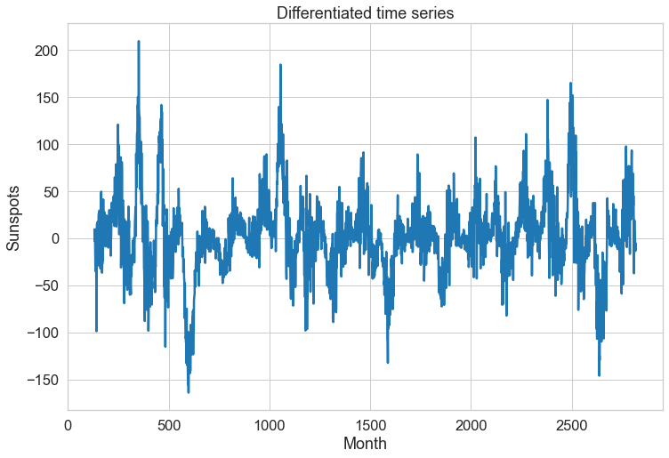
    


```python
print(PhillipsPerron(df_des['Sunspots_des'],lags=120))
print('\n',DFGLS(df_des['Sunspots_des'],lags=120))
print('\n',ADF(df_des['Sunspots_des'],lags=120))
print('\n',KPSS(df_des['Sunspots_des'],lags=120))
```

         Phillips-Perron Test (Z-tau)    
    =====================================
    Test Statistic                -23.467
    P-value                         0.000
    Lags                              120
    -------------------------------------
    
    Trend: Constant
    Critical Values: -3.43 (1%), -2.86 (5%), -2.57 (10%)
    Null Hypothesis: The process contains a unit root.
    Alternative Hypothesis: The process is weakly stationary.
    
           Dickey-Fuller GLS Results      
    =====================================
    Test Statistic                 -4.373
    P-value                         0.000
    Lags                              120
    -------------------------------------
    
    Trend: Constant
    Critical Values: -2.58 (1%), -1.95 (5%), -1.63 (10%)
    Null Hypothesis: The process contains a unit root.
    Alternative Hypothesis: The process is weakly stationary.
    
        Augmented Dickey-Fuller Results   
    =====================================
    Test Statistic                 -4.881
    P-value                         0.000
    Lags                              120
    -------------------------------------
    
    Trend: Constant
    Critical Values: -3.43 (1%), -2.86 (5%), -2.57 (10%)
    Null Hypothesis: The process contains a unit root.
    Alternative Hypothesis: The process is weakly stationary.
    
         KPSS Stationarity Test Results   
    =====================================
    Test Statistic                  0.067
    P-value                         0.770
    Lags                              120
    -------------------------------------
    
    Trend: Constant
    Critical Values: 0.74 (1%), 0.46 (5%), 0.35 (10%)
    Null Hypothesis: The process is weakly stationary.
    Alternative Hypothesis: The process contains a unit root.


###### Data modelling

After removing the seasonal and the trend components of the time series, we can now try to create a model to forecast the passenger counts for the next months. **Since we have transformed our data using the differencing method, after the forecasting, we need to we need to reverse the transformation (or back-transform) to obtain forecasts on the original scale**.

First we split our dataset in training and testing sets. We will use the first 4 years as the training set and the 5th year as the testing set.

We start with a simple average forecast. In this method, "the forecasts of all future values are equal to the average (or “mean”) of the historical data" (HYNDMAN; ATHANASOPOULOS, 2018). We verify that, as the mean absolute scaled error (MASE) is greater than 1, **the average forecast actually performs worse than the naive method** and, therefore, does not adds value.

We can try some ARIMA models too. First, we use an autoregressive (AR) model, where "we forecast the variable of interest using a linear combination of past values of the variable" (HYNDMAN; ATHANASOPOULOS, 2018). An AR model of order 9 is the best fit for the training data. We see that the AR(9) model performs slightly better than the average forecast, but once more the MASE is greater than 1, **so the AR model also performs worse than the naive method**.

The next model we test is a moving average (MA) model. It "uses past forecast errors in a regression-like model" (HYNDMAN; ATHANASOPOULOS, 2018). We create an MA model by using an ARIMA model and setting the order of the AR model the differencing to zero. We verify that a MA model of order 2 is the best fit for the training data. This MA(2) model performs worse than the previous models we tested, **and, therfore, also performs worse than the naive method**, as the MASE is above 1.

Finally, we can try some models the combines AR and MA. We use an ARMA model first, and then test an ARIMA model. The difference between the two is that while the ARMA model only combines autoregression and moving average models, the ARIMA model also uses differencing (HYNDMAN; ATHANASOPOULOS, 2018). We create an ARMA model by using an ARIMA model and setting the order of the differencing to zero, in an analagous way we created the MA model. 

We use two criteria to evaluate the models, the AICc and the MASE. Both cirteria give suggests different orders for the ARMA model: (9,9) and (6,7). esting both models with the test set, we verify that the ARMA(6,7) performs better for all other types of erros, MAE, RMSE, and MAPE. Therefore the best ARMA model for our data have order of the autoregressive part of 6 and order of the moving average part of 7. **However, this model have a MASE of 3.76, better than the previous models tested, but worse than the naive method**.

Regarding the ARIMA model, we can try to use the model directly with our data. We should remove the seasonal component form the data before using the ARIMA model. However, we first try using the ARIMA model directly into our data. We verify that the best ARIMA model for our data has order of the autoregressive part of 2, order of the moving average part of 0, and order of the differencing part 10. As expected, the the model does not perform well with we don't remove the seasonal component of the data. **This model have a MASE of 3.566, performing worse than than the naive method, although a little better thatn the AR, MA, and ARMA models we tried**.

Now, we use the ARIMA model with the deseasonalized data to see how it performs. We verify that the best ARIMA model for the deseasonalized time series has order of the autoregressive part of 8, order of the moving average part of 1, and order of the differencing part 10. **However, this model still does not perform well and, surprisingly, performs worse than the ARIMA models built using the time series without removing the seasonal component**. Nonetheless, it performs better than the other models previoulsy tried.

Therefore, we can now try the Seasonal Autoregressive Integrated Moving Average (SARIMA) method, also called Seasonal ARIMA. It is an extension of ARIMA that explicitly supports univariate time series data with a seasonal component. A seasonal ARIMA model is formed by including additional seasonal terms in the ARIMA models. It adds three new hyperparameters to specify the autoregression (AR), differencing (I) and moving average (MA) for the seasonal component of the series, as well as an additional parameter for the period of the seasonality. The modelling procedure is almost the same as for non-seasonal data, except that we need to select seasonal AR and MA terms as well as the non-seasonal components of the model.

Given the higher computing cost of the SARIMA method, we downsample the dataset from monthly to yearly samples, by taking the mean value the samples in a year as the value of this year sample. After doing this we use the SARIMA in two ways. First, we follow the procedure used for the other methods, and try to find the best parameters to be used in the model through an iteration process. **The result is a SARIMA (3,1,3)(3,1,3)11, which performed much better than the previous methods tested, with a MASE of 2.327**. 

The second way we use the SARIMA method is by trying to identify the parameters to be used in the ACF and PACF plots. The best model is a SARIMA (p,q,d)(P,Q,D)s which performed better than the previous SARIMA model we tested. The significant spike in lag 6 of the PACF suggests a non-seasonal AR(6). The first lag above the significance level at lag 22 in the ACF suggests a non-seasonal MA(22). Besides, the tests we did before suggests that there is some trend, although weak, in the time series. So we adopt d as 1 to include differencing. The exponential decay in the seasonal lags of the ACF suggests a seasonal AR(1). Besides, we assume a D=1. **The result is a SARIMA(6,1,22)(1,1,0). This model performed even better than the previous SARIMA we tested, with a MASE of 2.030. Although this value is still above 1, it is clearly the bes of all the models tested**.

------------------------------------


```python
#X = series.values
train_size_des = int(len(df_des) * 0.7)
train_des, test_des = df_des[0:train_size_des], df_des[train_size_des:len(df_des)]

print(train_des.info(),'\n')
print(test_des.info(),'\n')

train_size = int(len(df_date) * 0.7)
train, test = df_date[0:train_size], df_date[train_size:len(df_date)]

print(train.info(),'\n')
print(test.info(),'\n')
```

    <class 'pandas.core.frame.DataFrame'>
    Int64Index: 1881 entries, 132 to 2012
    Data columns (total 3 columns):
     #   Column        Non-Null Count  Dtype         
    ---  ------        --------------  -----         
     0   Date          1881 non-null   datetime64[ns]
     1   Sunspots      1881 non-null   float64       
     2   Sunspots_des  1881 non-null   float64       
    dtypes: datetime64[ns](1), float64(2)
    memory usage: 58.8 KB
    None 
    
    <class 'pandas.core.frame.DataFrame'>
    Int64Index: 807 entries, 2013 to 2819
    Data columns (total 3 columns):
     #   Column        Non-Null Count  Dtype         
    ---  ------        --------------  -----         
     0   Date          807 non-null    datetime64[ns]
     1   Sunspots      807 non-null    float64       
     2   Sunspots_des  807 non-null    float64       
    dtypes: datetime64[ns](1), float64(2)
    memory usage: 25.2 KB
    None 
    
    <class 'pandas.core.frame.DataFrame'>
    RangeIndex: 1973 entries, 0 to 1972
    Data columns (total 2 columns):
     #   Column    Non-Null Count  Dtype         
    ---  ------    --------------  -----         
     0   Date      1973 non-null   datetime64[ns]
     1   Sunspots  1973 non-null   float64       
    dtypes: datetime64[ns](1), float64(1)
    memory usage: 31.0 KB
    None 
    
    <class 'pandas.core.frame.DataFrame'>
    RangeIndex: 847 entries, 1973 to 2819
    Data columns (total 2 columns):
     #   Column    Non-Null Count  Dtype         
    ---  ------    --------------  -----         
     0   Date      847 non-null    datetime64[ns]
     1   Sunspots  847 non-null    float64       
    dtypes: datetime64[ns](1), float64(1)
    memory usage: 13.4 KB
    None 
    


```python
test.info()
```

    <class 'pandas.core.frame.DataFrame'>
    RangeIndex: 847 entries, 1973 to 2819
    Data columns (total 2 columns):
     #   Column    Non-Null Count  Dtype         
    ---  ------    --------------  -----         
     0   Date      847 non-null    datetime64[ns]
     1   Sunspots  847 non-null    float64       
    dtypes: datetime64[ns](1), float64(1)
    memory usage: 13.4 KB


```python
pd.set_option('display.max_columns', None)
```


```python
pd.set_option("max_rows", None)

#forecasting with average method
yhat_avg_des = pd.DataFrame().reindex_like(test)
yhat_avg_des['Date'] = test['Date']
yhat_avg_des['Sunspots_des'] = train_des['Sunspots_des'].mean()

m = (len(df_date) - len(df_des))
ki = test.index.values[0]
kf = ki + m
ji = kf + 1
jf = test_des.index.values[0] + len(test_des)

for i in range(ki,kf+1):
    yhat_avg_des.loc[i,'Sunspots'] = yhat_avg_des.loc[i,'Sunspots_des'] + train_des.loc[i-m,'Sunspots']
   
for i in range(ji,jf):
    yhat_avg_des.loc[i,'Sunspots'] = yhat_avg_des.loc[i,'Sunspots_des'] + yhat_avg_des.loc[i-m,'Sunspots']

yhat_avg_des.head()
```


<div>
<style scoped>
    .dataframe tbody tr th:only-of-type {
        vertical-align: middle;
    }

    .dataframe tbody tr th {
        vertical-align: top;
    }

    .dataframe thead th {
        text-align: right;
    }
</style>
<table border="1" class="dataframe">
  <thead>
    <tr style="text-align: right;">
      <th></th>
      <th>Date</th>
      <th>Sunspots</th>
      <th>Sunspots_des</th>
    </tr>
  </thead>
  <tbody>
    <tr>
      <th>1973</th>
      <td>1913-06-01</td>
      <td>0.76991</td>
      <td>-0.63009</td>
    </tr>
    <tr>
      <th>1974</th>
      <td>1913-07-01</td>
      <td>0.26991</td>
      <td>-0.63009</td>
    </tr>
    <tr>
      <th>1975</th>
      <td>1913-08-01</td>
      <td>1.66991</td>
      <td>-0.63009</td>
    </tr>
    <tr>
      <th>1976</th>
      <td>1913-09-01</td>
      <td>6.96991</td>
      <td>-0.63009</td>
    </tr>
    <tr>
      <th>1977</th>
      <td>1913-10-01</td>
      <td>15.66991</td>
      <td>-0.63009</td>
    </tr>
  </tbody>
</table>
</div>


```python
fig, axes = plt.subplots(2,1, figsize=(15, 20))

plt.figure(figsize=(16, 10))
sns.set_style("whitegrid")
sns.set_context("notebook", font_scale=1.5, rc={"lines.linewidth": 2.5})

dx = sns.lineplot(ax=axes[0],data=train_des,x='Date',y='Sunspots_des')
ex = sns.lineplot(ax=axes[0],data=test_des,x='Date',y='Sunspots_des')
fx = sns.lineplot(ax=axes[0],data=yhat_avg_des,x='Date',y='Sunspots_des')
axes[0].set(xlabel='Month', ylabel = 'Sunspots')
axes[0].set_title('Average method forecast - deseasonalized')
axes[0].set_ylim(-300,300)
#axes[0].set_xticks(np.arange(0, 36 + 1, 6))
axes[0].legend(labels=["Train data","Test data","Model Forecast"])

ax = sns.lineplot(ax=axes[1],data=train,x='Date',y='Sunspots')
bx = sns.lineplot(ax=axes[1],data=test,x='Date',y='Sunspots')
cx = sns.lineplot(ax=axes[1],data=yhat_avg_des,x='Date',y='Sunspots')
axes[1].set(xlabel='Month', ylabel = 'Sunspots')
axes[1].set_title('Average method forecast')
axes[1].set_ylim(-200,400)
#axes[1].set_xticks(np.arange(0, 36 + 1, 6))
axes[1].legend(labels=["Train data","Test data","Model Forecast"])

plt.show()
```


    
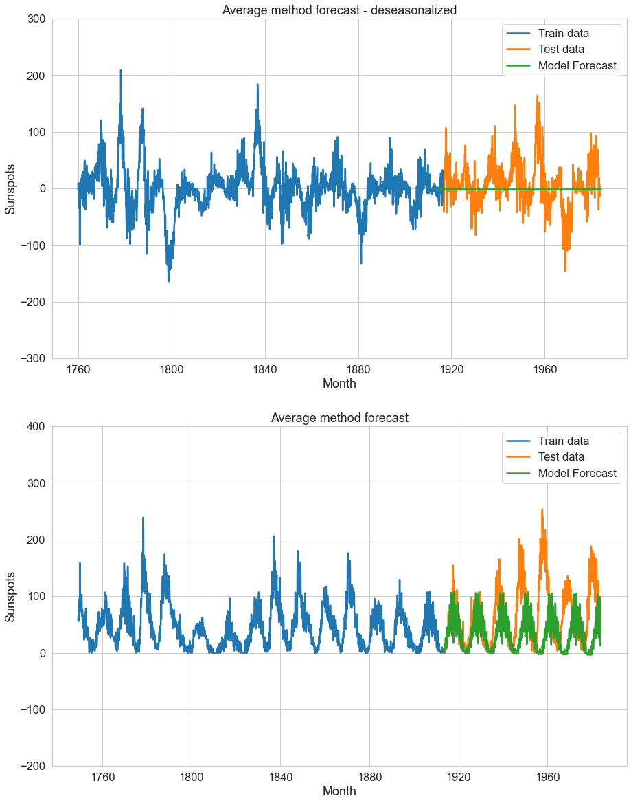
    


    <Figure size 1152x720 with 0 Axes>


```python
from sklearn.metrics import median_absolute_error, mean_squared_error, mean_absolute_percentage_error

def MASE_func(training_series, testing_series, prediction_series):

    n = training_series.shape[0]
    d = np.abs(  np.diff( training_series) ).sum()/(n-1)
    
    errors = np.abs(testing_series - prediction_series )
    return errors.mean()/d

MAE = median_absolute_error(test['Sunspots'], yhat_avg_des['Sunspots'])
RMSE = mean_squared_error(test['Sunspots'], yhat_avg_des['Sunspots'],squared=False)
MAPE = mean_absolute_percentage_error(test['Sunspots'], yhat_avg_des['Sunspots'])
MASE = MASE_func(train['Sunspots'],test['Sunspots'],yhat_avg_des['Sunspots'])
print('MAE=%.3f'% MAE)
print('RMSE=%.3f'% RMSE)
print('MAPE=%.3f'% MAPE)
print('MASE=%.3f'% MASE)
```

    MAE=27.370
    RMSE=64.769
    MAPE=4093700931743.334
    MASE=3.912


```python
#find the best order for the AR Model

from statsmodels.tsa.ar_model import AutoReg, ar_select_order
from statsmodels.tsa.api import acf, pacf, graphics

sel = ar_select_order(train_des['Sunspots_des'], maxlag=500, trend='n', old_names=False)
sel.ar_lags
res_ar = sel.model.fit()
print(res_ar.summary())
warnings.filterwarnings("ignore")
```

                                AutoReg Model Results                             
    ==============================================================================
    Dep. Variable:           Sunspots_des   No. Observations:                 1881
    Model:                     AutoReg(9)   Log Likelihood               -8310.750
    Method:               Conditional MLE   S.D. of innovations             20.503
    Date:                Thu, 27 May 2021   AIC                              6.052
    Time:                        10:51:58   BIC                              6.081
    Sample:                             9   HQIC                             6.063
                                     1881                                         
    ===================================================================================
                          coef    std err          z      P>|z|      [0.025      0.975]
    -----------------------------------------------------------------------------------
    Sunspots_des.L1     0.5359      0.023     23.282      0.000       0.491       0.581
    Sunspots_des.L2     0.1286      0.026      4.924      0.000       0.077       0.180
    Sunspots_des.L3     0.0331      0.026      1.258      0.208      -0.018       0.085
    Sunspots_des.L4     0.0676      0.026      2.573      0.010       0.016       0.119
    Sunspots_des.L5     0.0319      0.026      1.214      0.225      -0.020       0.083
    Sunspots_des.L6     0.0635      0.026      2.418      0.016       0.012       0.115
    Sunspots_des.L7    -0.0256      0.026     -0.972      0.331      -0.077       0.026
    Sunspots_des.L8     0.0157      0.026      0.601      0.548      -0.036       0.067
    Sunspots_des.L9     0.0882      0.023      3.827      0.000       0.043       0.133
                                        Roots                                    
    =============================================================================
                      Real          Imaginary           Modulus         Frequency
    -----------------------------------------------------------------------------
    AR.1            1.0238           -0.0000j            1.0238           -0.0000
    AR.2            1.0712           -0.7717j            1.3202           -0.0994
    AR.3            1.0712           +0.7717j            1.3202            0.0994
    AR.4            0.3429           -1.2727j            1.3181           -0.2081
    AR.5            0.3429           +1.2727j            1.3181            0.2081
    AR.6           -0.6528           -1.1703j            1.3400           -0.3310
    AR.7           -0.6528           +1.1703j            1.3400            0.3310
    AR.8           -1.3624           -0.4252j            1.4272           -0.4519
    AR.9           -1.3624           +0.4252j            1.4272            0.4519
    -----------------------------------------------------------------------------


```python
fig = plt.figure(figsize=(16,9))
fig = res_ar.plot_diagnostics(lags=11, fig=fig)
```


    
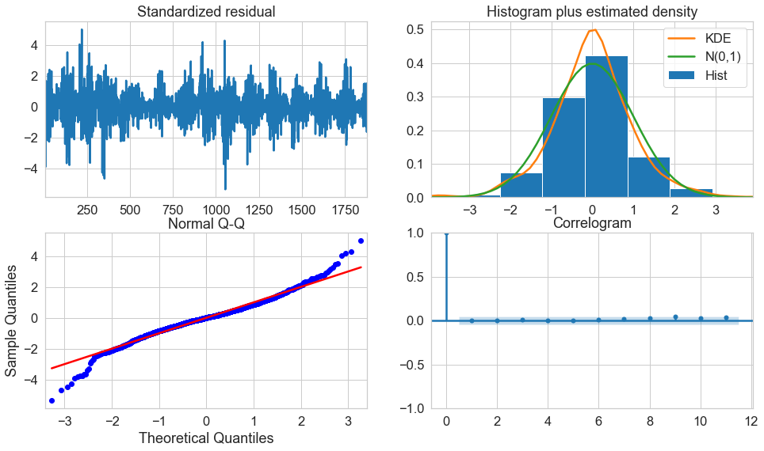
    


```python
yhat_AR = res_ar.predict(start=len(train_des['Sunspots_des'])+1, end=(len(df_date)), dynamic=False)

yhat_AR_des = pd.DataFrame().reindex_like(test)
yhat_AR_des['Sunspots_des'] = yhat_AR
yhat_AR_des['Date'] = test['Date']

m = (len(df_date) - len(df_des))
ki = test.index.values[0]
kf = ki + m
ji = kf + 1
jf = test_des.index.values[0] + len(test_des)

for i in range(ki,kf+1):
    yhat_AR_des.loc[i,'Sunspots'] = yhat_AR_des.loc[i,'Sunspots_des'] + train_des.loc[i-m,'Sunspots']

for i in range(ji,jf):
    yhat_AR_des.loc[i,'Sunspots'] = yhat_AR_des.loc[i,'Sunspots_des'] + yhat_avg_des.loc[i-m,'Sunspots']

yhat_AR_des.head()
```


<div>
<style scoped>
    .dataframe tbody tr th:only-of-type {
        vertical-align: middle;
    }

    .dataframe tbody tr th {
        vertical-align: top;
    }

    .dataframe thead th {
        text-align: right;
    }
</style>
<table border="1" class="dataframe">
  <thead>
    <tr style="text-align: right;">
      <th></th>
      <th>Date</th>
      <th>Sunspots</th>
      <th>Sunspots_des</th>
    </tr>
  </thead>
  <tbody>
    <tr>
      <th>1973</th>
      <td>1913-06-01</td>
      <td>0.802777</td>
      <td>-0.597223</td>
    </tr>
    <tr>
      <th>1974</th>
      <td>1913-07-01</td>
      <td>0.316633</td>
      <td>-0.583367</td>
    </tr>
    <tr>
      <th>1975</th>
      <td>1913-08-01</td>
      <td>1.730167</td>
      <td>-0.569833</td>
    </tr>
    <tr>
      <th>1976</th>
      <td>1913-09-01</td>
      <td>7.043387</td>
      <td>-0.556613</td>
    </tr>
    <tr>
      <th>1977</th>
      <td>1913-10-01</td>
      <td>15.756301</td>
      <td>-0.543699</td>
    </tr>
  </tbody>
</table>
</div>


```python
fig, axes = plt.subplots(2,1, figsize=(15, 20))

plt.figure(figsize=(16, 10))
sns.set_style("whitegrid")
sns.set_context("notebook", font_scale=1.5, rc={"lines.linewidth": 2.5})

dx = sns.lineplot(ax=axes[0],data=train_des,x='Date',y='Sunspots_des')
ex = sns.lineplot(ax=axes[0],data=test_des,x='Date',y='Sunspots_des')
fx = sns.lineplot(ax=axes[0],data=yhat_AR_des,x='Date',y='Sunspots_des')
axes[0].set(xlabel='Month', ylabel = 'Sunspots')
axes[0].set_title('AR model forecast - deseasonalized')
axes[0].set_ylim(-200,200)
#axes[0].set_xticks(np.arange(0, 36 + 1, 6))
axes[0].legend(labels=["Train data","Test data","Model Forecast"])

ax = sns.lineplot(ax=axes[1],data=train,x='Date',y='Sunspots')
bx = sns.lineplot(ax=axes[1],data=test,x='Date',y='Sunspots')
cx = sns.lineplot(ax=axes[1],data=yhat_AR_des,x='Date',y='Sunspots')
axes[1].set(xlabel='Month', ylabel = 'Sunspots')
axes[1].set_title('AR model forecast')
axes[1].set_ylim(0,300)
#axes[1].set_xticks(np.arange(0, 36 + 1, 6))
axes[1].legend(labels=["Train data","Test data","Model Forecast"])

plt.show()
```


    
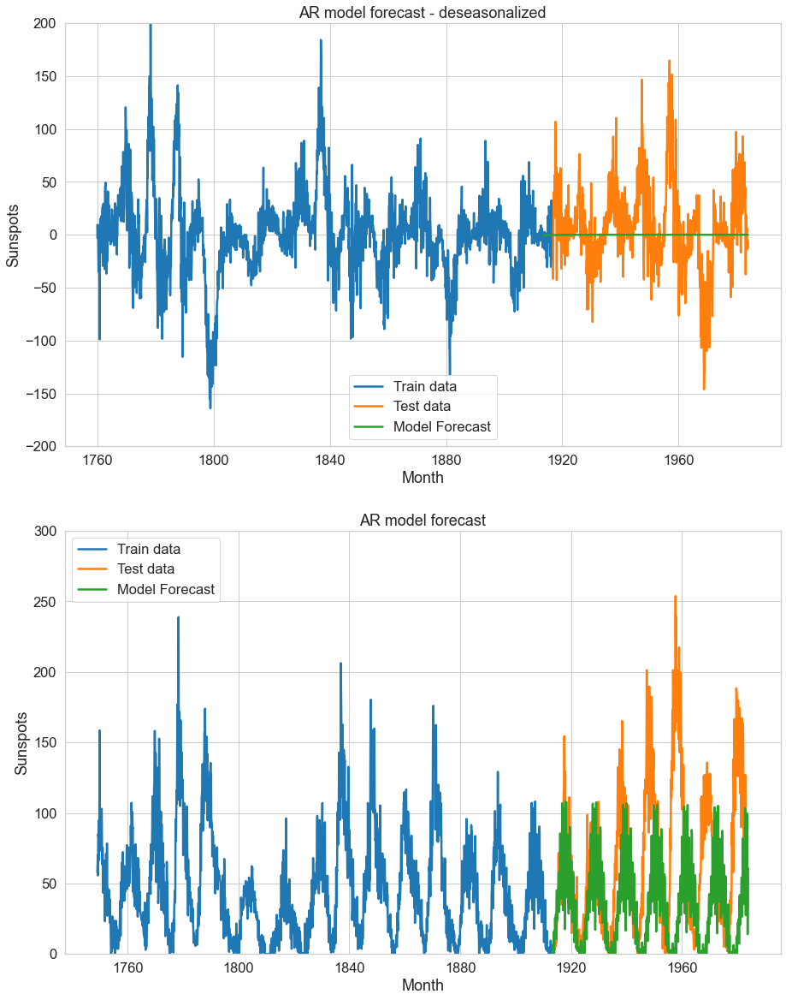
    


    <Figure size 1152x720 with 0 Axes>


```python
MAE = median_absolute_error(test['Sunspots'], yhat_AR_des['Sunspots'])
RMSE = mean_squared_error(test['Sunspots'], yhat_AR_des['Sunspots'],squared=False)
MAPE = mean_absolute_percentage_error(test['Sunspots'], yhat_AR_des['Sunspots'])
MASE = MASE_func(train['Sunspots'],test['Sunspots'],yhat_AR_des['Sunspots'])
print('MAE=%.3f'% MAE)
print('RMSE=%.3f'% RMSE)
print('MAPE=%.3f'% MAPE)
print('MASE=%.3f'% MASE)
```

    MAE=27.240
    RMSE=64.443
    MAPE=4268459501193.259
    MASE=3.890


```python
#find the best order for the MA Model

from statsmodels.tsa.arima.model import ARIMA

MA = pd.DataFrame(columns=['order','MAE','RMSE','MAPE','MASE'])
for i in range(16):
    MA_model = ARIMA(train_des['Sunspots_des'], order=(0, 0, i))
    res_MA = MA_model.fit()
    yhat_MA = res_MA.predict(start=len(train_des['Sunspots_des'])+1, end=(len(df_date)), dynamic=False)
    try:
        MAE = median_absolute_error(train_des['Sunspots_des'], yhat_MA)
    except:
        pass
    try:
        RMSE = mean_squared_error(train_des['Sunspots_des'], yhat_MA,squared=False)
    except:
        pass 
    try:
        MAPE = mean_absolute_percentage_error(train_des['Sunspots_des'], yhat_MA)
    except:
        pass     
    try:
        MASE = MASE_func(train_des['Sunspots_des'],test_des['Sunspots_des'],yhat_MA)
    except:
        pass            
    MA2 = pd.Series([i,MAE,RMSE,MAPE,MASE], index=MA.columns )
    #MA2 = pd.DataFrame([[i,MAE,RMSE,MAPE,MASE]])
    MA = MA.append(MA2,ignore_index=True)
    #print(MA)
#warnings.filterwarnings("ignore")
MA
```


<div>
<style scoped>
    .dataframe tbody tr th:only-of-type {
        vertical-align: middle;
    }

    .dataframe tbody tr th {
        vertical-align: top;
    }

    .dataframe thead th {
        text-align: right;
    }
</style>
<table border="1" class="dataframe">
  <thead>
    <tr style="text-align: right;">
      <th></th>
      <th>order</th>
      <th>MAE</th>
      <th>RMSE</th>
      <th>MAPE</th>
      <th>MASE</th>
    </tr>
  </thead>
  <tbody>
    <tr>
      <th>0</th>
      <td>0.0</td>
      <td>27.239992</td>
      <td>64.443314</td>
      <td>4.268460e+12</td>
      <td>1.762727</td>
    </tr>
    <tr>
      <th>1</th>
      <td>1.0</td>
      <td>27.239992</td>
      <td>64.443314</td>
      <td>4.268460e+12</td>
      <td>1.762721</td>
    </tr>
    <tr>
      <th>2</th>
      <td>2.0</td>
      <td>27.239992</td>
      <td>64.443314</td>
      <td>4.268460e+12</td>
      <td>1.762713</td>
    </tr>
    <tr>
      <th>3</th>
      <td>3.0</td>
      <td>27.239992</td>
      <td>64.443314</td>
      <td>4.268460e+12</td>
      <td>1.762715</td>
    </tr>
    <tr>
      <th>4</th>
      <td>4.0</td>
      <td>27.239992</td>
      <td>64.443314</td>
      <td>4.268460e+12</td>
      <td>1.762726</td>
    </tr>
    <tr>
      <th>5</th>
      <td>5.0</td>
      <td>27.239992</td>
      <td>64.443314</td>
      <td>4.268460e+12</td>
      <td>1.762728</td>
    </tr>
    <tr>
      <th>6</th>
      <td>6.0</td>
      <td>27.239992</td>
      <td>64.443314</td>
      <td>4.268460e+12</td>
      <td>1.762729</td>
    </tr>
    <tr>
      <th>7</th>
      <td>7.0</td>
      <td>27.239992</td>
      <td>64.443314</td>
      <td>4.268460e+12</td>
      <td>1.762732</td>
    </tr>
    <tr>
      <th>8</th>
      <td>8.0</td>
      <td>27.239992</td>
      <td>64.443314</td>
      <td>4.268460e+12</td>
      <td>1.762735</td>
    </tr>
    <tr>
      <th>9</th>
      <td>9.0</td>
      <td>27.239992</td>
      <td>64.443314</td>
      <td>4.268460e+12</td>
      <td>1.762738</td>
    </tr>
    <tr>
      <th>10</th>
      <td>10.0</td>
      <td>27.239992</td>
      <td>64.443314</td>
      <td>4.268460e+12</td>
      <td>1.762731</td>
    </tr>
    <tr>
      <th>11</th>
      <td>11.0</td>
      <td>27.239992</td>
      <td>64.443314</td>
      <td>4.268460e+12</td>
      <td>1.762724</td>
    </tr>
    <tr>
      <th>12</th>
      <td>12.0</td>
      <td>27.239992</td>
      <td>64.443314</td>
      <td>4.268460e+12</td>
      <td>1.762718</td>
    </tr>
    <tr>
      <th>13</th>
      <td>13.0</td>
      <td>27.239992</td>
      <td>64.443314</td>
      <td>4.268460e+12</td>
      <td>1.762715</td>
    </tr>
    <tr>
      <th>14</th>
      <td>14.0</td>
      <td>27.239992</td>
      <td>64.443314</td>
      <td>4.268460e+12</td>
      <td>1.762716</td>
    </tr>
    <tr>
      <th>15</th>
      <td>15.0</td>
      <td>27.239992</td>
      <td>64.443314</td>
      <td>4.268460e+12</td>
      <td>1.762721</td>
    </tr>
  </tbody>
</table>
</div>


```python
fig_MA, axes = plt.subplots(1,2,figsize=(16,8), dpi= 100)
fig_MA.suptitle('MASE and MAPE for different orders of the MA model')

sns.set_style("whitegrid")
sns.set_context("notebook", font_scale=1.5, rc={"lines.linewidth": 2.5})
sns.lineplot(data=MA['MAPE'], ax=axes[0])
#ax.set_xticks(np.arange(0, 60 + 1, 1))
axes[0].set(xlabel='Order', ylabel = 'MAPE')
axes[0].set_xlim(0,15)

sns.set_style("whitegrid")
sns.set_context("notebook", font_scale=1.5, rc={"lines.linewidth": 2.5})
sns.lineplot(data=MA['MASE'], ax=axes[1])
#ax.set_xticks(np.arange(0, 60 + 1, 1))
axes[1].set(xlabel='Order', ylabel = 'MASE')
axes[1].set_xlim(0,15)

plt.show()
```


    
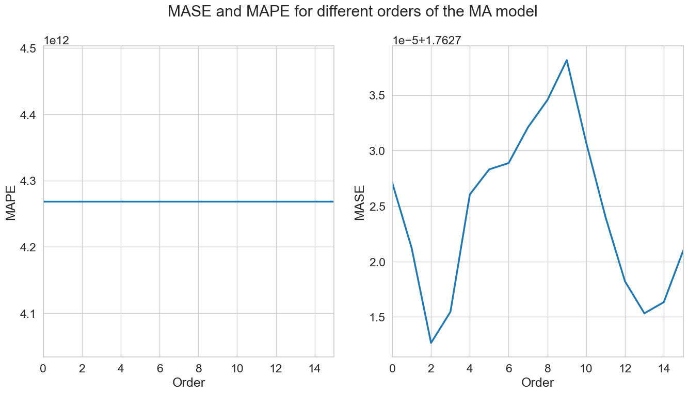
    


```python
print('Minimum ',MA[['MAE']].idxmin())
print('Minimum ',MA[['RMSE']].idxmin())
print('Minimum ',MA[['MAPE']].idxmin())
print('Minimum ',MA[['MASE']].idxmin())
```

    Minimum  MAE    0
    dtype: int64
    Minimum  RMSE    0
    dtype: int64
    Minimum  MAPE    0
    dtype: int64
    Minimum  MASE    2
    dtype: int64


```python
from statsmodels.tsa.arima.model import ARIMAResults

MA_model = ARIMA(train_des['Sunspots_des'], order=(0, 0, 2))
res_MA = MA_model.fit()

print(res_MA.summary())

warnings.filterwarnings("ignore")
```

                                   SARIMAX Results                                
    ==============================================================================
    Dep. Variable:           Sunspots_des   No. Observations:                 1881
    Model:                 ARIMA(0, 0, 2)   Log Likelihood               -8813.617
    Date:                Thu, 27 May 2021   AIC                          17635.233
    Time:                        10:54:35   BIC                          17657.392
    Sample:                             0   HQIC                         17643.395
                                   - 1881                                         
    Covariance Type:                  opg                                         
    ==============================================================================
                     coef    std err          z      P>|z|      [0.025      0.975]
    ------------------------------------------------------------------------------
    const         -0.6288      1.314     -0.479      0.632      -3.204       1.946
    ma.L1          0.7346      0.017     43.356      0.000       0.701       0.768
    ma.L2          0.4266      0.017     25.773      0.000       0.394       0.459
    sigma2       687.4244     15.581     44.121      0.000     656.887     717.962
    ===================================================================================
    Ljung-Box (L1) (Q):                  54.23   Jarque-Bera (JB):               389.92
    Prob(Q):                              0.00   Prob(JB):                         0.00
    Heteroskedasticity (H):               0.42   Skew:                             0.02
    Prob(H) (two-sided):                  0.00   Kurtosis:                         5.23
    ===================================================================================
    
    Warnings:
    [1] Covariance matrix calculated using the outer product of gradients (complex-step).


```python
yhat_MA = res_MA.predict(start=len(train_des['Sunspots_des'])+1, end=(len(df_date)), dynamic=False)

yhat_MA_des = pd.DataFrame().reindex_like(test)
yhat_MA_des['Sunspots_des'] = yhat_MA
yhat_MA_des['Date'] = test['Date']

m = (len(df_date) - len(df_des))
ki = test.index.values[0]
kf = ki + m
ji = kf + 1
jf = test_des.index.values[0] + len(test_des)

for i in range(ki,kf+1):
    yhat_MA_des.loc[i,'Sunspots'] = yhat_MA_des.loc[i,'Sunspots_des'] + train_des.loc[i-m,'Sunspots']

for i in range(ji,jf):
    yhat_MA_des.loc[i,'Sunspots'] = yhat_MA_des.loc[i,'Sunspots_des'] + yhat_MA_des.loc[i-m,'Sunspots']

yhat_MA_des.head()
```

    132 1973 2105 2106 2820


<div>
<style scoped>
    .dataframe tbody tr th:only-of-type {
        vertical-align: middle;
    }

    .dataframe tbody tr th {
        vertical-align: top;
    }

    .dataframe thead th {
        text-align: right;
    }
</style>
<table border="1" class="dataframe">
  <thead>
    <tr style="text-align: right;">
      <th></th>
      <th>Date</th>
      <th>Sunspots</th>
      <th>Sunspots_des</th>
    </tr>
  </thead>
  <tbody>
    <tr>
      <th>1973</th>
      <td>1913-06-01</td>
      <td>0.771242</td>
      <td>-0.628758</td>
    </tr>
    <tr>
      <th>1974</th>
      <td>1913-07-01</td>
      <td>0.271242</td>
      <td>-0.628758</td>
    </tr>
    <tr>
      <th>1975</th>
      <td>1913-08-01</td>
      <td>1.671242</td>
      <td>-0.628758</td>
    </tr>
    <tr>
      <th>1976</th>
      <td>1913-09-01</td>
      <td>6.971242</td>
      <td>-0.628758</td>
    </tr>
    <tr>
      <th>1977</th>
      <td>1913-10-01</td>
      <td>15.671242</td>
      <td>-0.628758</td>
    </tr>
  </tbody>
</table>
</div>


```python
fig, axes = plt.subplots(2,1, figsize=(15, 20))

plt.figure(figsize=(16, 10))
sns.set_style("whitegrid")
sns.set_context("notebook", font_scale=1.5, rc={"lines.linewidth": 2.5})

dx = sns.lineplot(ax=axes[0],data=train_des,x='Date',y='Sunspots_des')
ex = sns.lineplot(ax=axes[0],data=test_des,x='Date',y='Sunspots_des')
fx = sns.lineplot(ax=axes[0],data=yhat_MA_des,x='Date',y='Sunspots_des')
axes[0].set(xlabel='Month', ylabel = 'Sunspots')
axes[0].set_title('MA model forecast - differentiated')
axes[0].set_ylim(-200,200)
#axes[0].set_xticks(np.arange(0, 36 + 1, 6))
axes[0].legend(labels=["Train data","Test data","Model Forecast"])

ax = sns.lineplot(ax=axes[1],data=train,x='Date',y='Sunspots')
bx = sns.lineplot(ax=axes[1],data=test,x='Date',y='Sunspots')
cx = sns.lineplot(ax=axes[1],data=yhat_MA_des,x='Date',y='Sunspots')
axes[1].set(xlabel='Month', ylabel = 'Sunspots')
axes[1].set_title('MA model forecast')
axes[1].set_ylim(0,300)
#axes[1].set_xticks(np.arange(0, 36 + 1, 6))
axes[1].legend(labels=["Train data","Test data","Model Forecast"])

plt.show()
```


    

    


    <Figure size 1152x720 with 0 Axes>


```python
MAE = median_absolute_error(test['Sunspots'], yhat_MA_des['Sunspots'])
RMSE = mean_squared_error(test['Sunspots'], yhat_MA_des['Sunspots'],squared=False)
MAPE = mean_absolute_percentage_error(test['Sunspots'], yhat_MA_des['Sunspots'])
MASE = MASE_func(train['Sunspots'],test['Sunspots'],yhat_MA_des['Sunspots'])
print('MAE=%.3f'% MAE)
print('RMSE=%.3f'% RMSE)
print('MAPE=%.3f'% MAPE)
print('MASE=%.3f'% MASE)
```

    MAE=27.371
    RMSE=64.766
    MAPE=4100782867938.119
    MASE=3.911


```python
# calculate AICc from AIC
def calculate_AICc(train, arma_order):
    model = ARIMA(train, order=arma_order)
    model_fit = model.fit()
    aic = model_fit.aic
    parameters = sum(arma_order)
    T = len(train)
    aicc = aic+(2*(parameters+2)*(parameters+3))/(T-(parameters+3))
    return aicc  
```


```python
# evaluate an ARIMA model for a given order (p,d,q)
  
# evaluate combinations of p, d, and q values for an ARIMA model
def evaluate_ARIMA(train, test, p_values, d_values, q_values, matriz):
    best_aicc, best_mase, best_order_aicc, best_order_mase = float("inf"),float("inf"), None, None
    k_i = train.index.values[0] + len(train)
    k_f = k_i + len(test) - 1
    for p in p_values:
        for d in d_values:
            for q in q_values:
                order = (p,d,q)
                try:
                    #calculate aicc
                    aicc = calculate_AICc(train, order)
                    if aicc < best_aicc:
                        best_aicc, best_order_aicc = aicc, (p,d,q)


                    #calculate MASE
                    model_ = ARIMA(train, order=(p,d,q))
                    res_ = model_.fit()
                    yhat_ = res_.predict(start=k_i, end=k_f, dynamic=False)
                    mase = MASE_func(train,test,yhat_)
                    if mase < best_mase:
                        best_mase, best_order_mase = mase, (p,d,q)                
                
                    #store values
                    matriz2 = pd.Series([order,aicc,mase], index=matriz.columns)
                    matriz = matriz.append(matriz2,ignore_index=True)
                except:
                    continue
    print('Best ARIMA%s AICc=%.3f' % (best_order_aicc, best_aicc))
    print('Best ARIMA%s MASE=%.3f' % (best_order_mase, best_mase))
    return matriz
```


```python
#ARMA model
p_values = range(11)
d_values = range(0,1)
q_values = range(11)
ARMA = pd.DataFrame(columns=['order','AICc','MASE'])
ARMA1 = evaluate_ARIMA(train_des['Sunspots_des'],test_des['Sunspots_des'] , p_values, d_values, q_values,ARMA)
warnings.filterwarnings("ignore")
ARMA1.head()
```

    Best ARIMA(9, 0, 9) AICc=16677.312
    Best ARIMA(6, 0, 7) MASE=1.754


<div>
<style scoped>
    .dataframe tbody tr th:only-of-type {
        vertical-align: middle;
    }

    .dataframe tbody tr th {
        vertical-align: top;
    }

    .dataframe thead th {
        text-align: right;
    }
</style>
<table border="1" class="dataframe">
  <thead>
    <tr style="text-align: right;">
      <th></th>
      <th>order</th>
      <th>AICc</th>
      <th>MASE</th>
    </tr>
  </thead>
  <tbody>
    <tr>
      <th>0</th>
      <td>(0, 0, 0)</td>
      <td>19250.996404</td>
      <td>1.762727</td>
    </tr>
    <tr>
      <th>1</th>
      <td>(0, 0, 1)</td>
      <td>18135.914577</td>
      <td>1.762721</td>
    </tr>
    <tr>
      <th>2</th>
      <td>(0, 0, 2)</td>
      <td>17635.254620</td>
      <td>1.762713</td>
    </tr>
    <tr>
      <th>3</th>
      <td>(0, 0, 3)</td>
      <td>17389.177556</td>
      <td>1.762715</td>
    </tr>
    <tr>
      <th>4</th>
      <td>(0, 0, 4)</td>
      <td>17256.315107</td>
      <td>1.762726</td>
    </tr>
  </tbody>
</table>
</div>


```python
k_i = train_des.index.values[0] + len(train_des)
k_f = k_i + len(test_des) - 1

ARMA_model = ARIMA(train_des['Sunspots_des'], order=(9, 0, 9))
res_ARMA = ARMA_model.fit()
yhat_ARMA = res_ARMA.predict(start=k_i, end=k_f, dynamic=False)

ARMA_model2 = ARIMA(train_des['Sunspots_des'], order=(6, 0, 7))
res_ARMA2 = ARMA_model2.fit()
yhat_ARMA2 = res_ARMA2.predict(start=k_i, end=k_f, dynamic=False)

plt.figure(figsize=(16, 10))
sns.set_style("whitegrid")
sns.set_context("notebook", font_scale=1.5, rc={"lines.linewidth": 2.5})
ax = sns.lineplot(data=yhat_ARMA)
ax.set(xlabel='Month', ylabel = 'Sunspots')
ax.set_title('ARMA model forecast')
#ax.set_xlim(49,60)
bx = sns.lineplot(data=yhat_ARMA2)
cx = sns.lineplot(data=test_des['Sunspots_des'])
plt.legend(labels=["Model forecast (9,9)", "Model forecast (6,7)","Test data"])
plt.show()
warnings.filterwarnings("ignore")
```


    
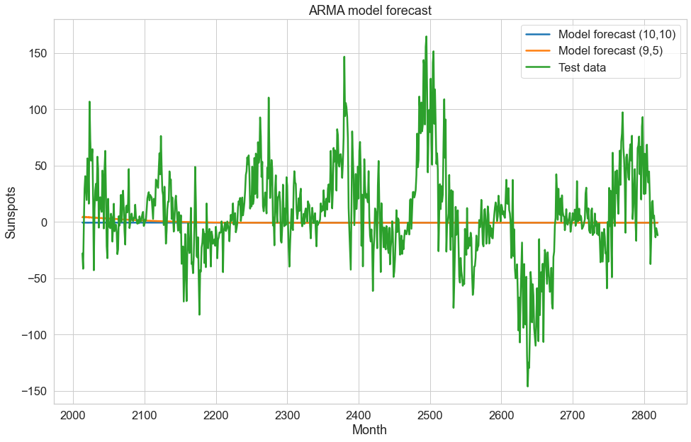
    


```python
MAE = median_absolute_error(test_des['Sunspots_des'], yhat_ARMA)
RMSE = mean_squared_error(test_des['Sunspots_des'], yhat_ARMA,squared=False)
MAPE = mean_absolute_percentage_error(test_des['Sunspots_des'], yhat_ARMA)
MASE = MASE_func(train_des['Sunspots_des'],test_des['Sunspots_des'],yhat_ARMA)
print("ARMA(9,9):")
print('MAE=%.3f'% MAE)
print('RMSE=%.3f'% RMSE)
print('MAPE=%.3f'% MAPE)
print('MASE=%.3f'% MASE)

MAE = median_absolute_error(test_des['Sunspots_des'], yhat_ARMA2)
RMSE = mean_squared_error(test_des['Sunspots_des'], yhat_ARMA2,squared=False)
MAPE = mean_absolute_percentage_error(test_des['Sunspots_des'], yhat_ARMA2)
MASE = MASE_func(train_des['Sunspots_des'],test_des['Sunspots_des'],yhat_ARMA2)
print("\nARMA(6,5):")
print('MAE=%.3f'% MAE)
print('RMSE=%.3f'% RMSE)
print('MAPE=%.3f'% MAPE)
print('MASE=%.3f'% MASE)
```

    ARMA(10,10):
    MAE=20.530
    RMSE=41.069
    MAPE=10864787096303.293
    MASE=1.763
    
    ARMA(9,5):
    MAE=20.383
    RMSE=40.948
    MAPE=21453196409851.930
    MASE=1.754


```python
yhat_ARMA = res_ARMA2.predict(start=len(train_des['Sunspots_des'])+1, end=(len(df_date)), dynamic=False)

yhat_ARMA_des = pd.DataFrame().reindex_like(test)
yhat_ARMA_des['Sunspots_des'] = yhat_ARMA
yhat_ARMA_des['Date'] = test['Date']

m = (len(df_date) - len(df_des))
ki = test.index.values[0]
kf = ki + m
ji = kf + 1
jf = test_des.index.values[0] + len(test_des)

for i in range(ki,kf+1):
    yhat_ARMA_des.loc[i,'Sunspots'] = yhat_ARMA_des.loc[i,'Sunspots_des'] + train_des.loc[i-m,'Sunspots']

for i in range(ji,jf):
    yhat_ARMA_des.loc[i,'Sunspots'] = yhat_ARMA_des.loc[i,'Sunspots_des'] + yhat_ARMA_des.loc[i-m,'Sunspots']

yhat_ARMA_des.head()

```


<div>
<style scoped>
    .dataframe tbody tr th:only-of-type {
        vertical-align: middle;
    }

    .dataframe tbody tr th {
        vertical-align: top;
    }

    .dataframe thead th {
        text-align: right;
    }
</style>
<table border="1" class="dataframe">
  <thead>
    <tr style="text-align: right;">
      <th></th>
      <th>Date</th>
      <th>Sunspots</th>
      <th>Sunspots_des</th>
    </tr>
  </thead>
  <tbody>
    <tr>
      <th>1973</th>
      <td>1913-06-01</td>
      <td>7.672800</td>
      <td>6.272800</td>
    </tr>
    <tr>
      <th>1974</th>
      <td>1913-07-01</td>
      <td>5.666081</td>
      <td>4.766081</td>
    </tr>
    <tr>
      <th>1975</th>
      <td>1913-08-01</td>
      <td>7.907883</td>
      <td>5.607883</td>
    </tr>
    <tr>
      <th>1976</th>
      <td>1913-09-01</td>
      <td>13.272704</td>
      <td>5.672704</td>
    </tr>
    <tr>
      <th>1977</th>
      <td>1913-10-01</td>
      <td>21.134699</td>
      <td>4.834699</td>
    </tr>
  </tbody>
</table>
</div>


```python
fig, axes = plt.subplots(2,1, figsize=(15, 20))

plt.figure(figsize=(16, 10))
sns.set_style("whitegrid")
sns.set_context("notebook", font_scale=1.5, rc={"lines.linewidth": 2.5})

dx = sns.lineplot(ax=axes[0],data=train_des,x='Date',y='Sunspots_des')
ex = sns.lineplot(ax=axes[0],data=test_des,x='Date',y='Sunspots_des')
fx = sns.lineplot(ax=axes[0],data=yhat_ARMA_des,x='Date',y='Sunspots_des')
axes[0].set(xlabel='Month', ylabel = 'Sunspots')
axes[0].set_title('ARMA model forecast - deseasonalized')
axes[0].set_ylim(-200,200)
#axes[0].set_xticks(np.arange(0, 36 + 1, 6))
axes[0].legend(labels=["Train data","Test data","Model Forecast"])

ax = sns.lineplot(ax=axes[1],data=train,x='Date',y='Sunspots')
bx = sns.lineplot(ax=axes[1],data=test,x='Date',y='Sunspots')
cx = sns.lineplot(ax=axes[1],data=yhat_ARMA_des,x='Date',y='Sunspots')
axes[1].set(xlabel='Month', ylabel = 'Sunspots')
axes[1].set_title('ARMA model forecast')
axes[1].set_ylim(0,300)
#axes[1].set_xticks(np.arange(0, 36 + 1, 6))
axes[1].legend(labels=["Train data","Test data","Model Forecast"])

plt.show()
```


    
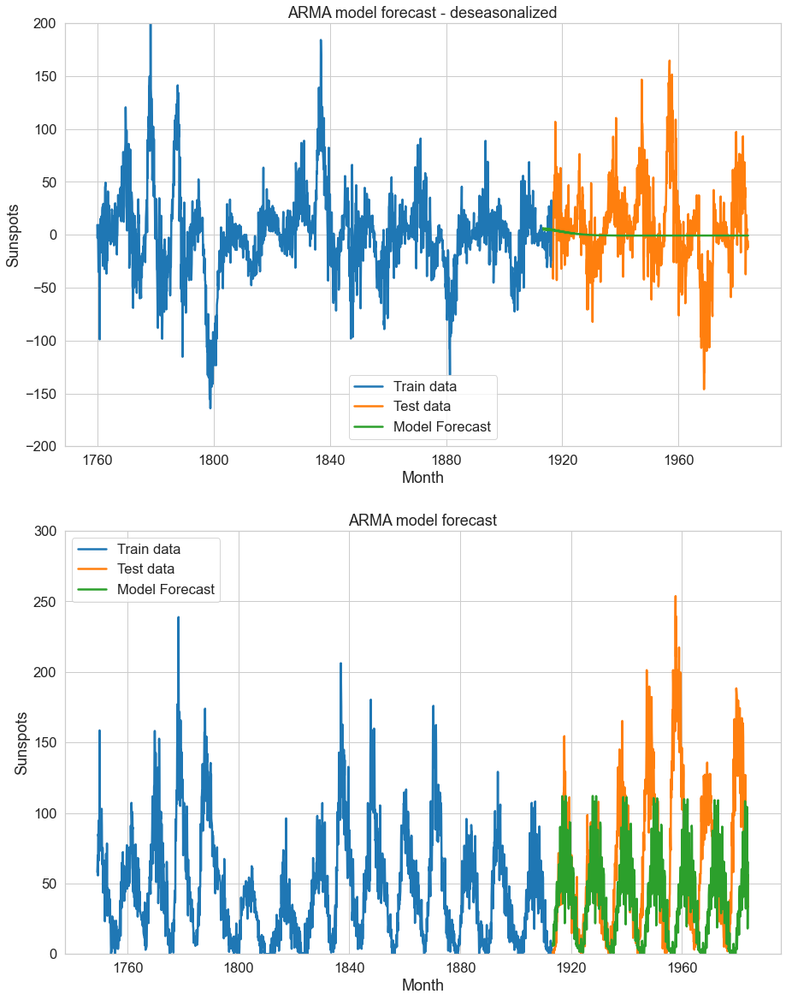
    


    <Figure size 1152x720 with 0 Axes>


```python
MAE = median_absolute_error(test['Sunspots'], yhat_ARMA_des['Sunspots'])
RMSE = mean_squared_error(test['Sunspots'], yhat_ARMA_des['Sunspots'],squared=False)
MAPE = mean_absolute_percentage_error(test['Sunspots'], yhat_ARMA_des['Sunspots'])
MASE = MASE_func(train['Sunspots'],test['Sunspots'],yhat_ARMA_des['Sunspots'])

print('MAE=%.3f'% MAE)
print('RMSE=%.3f'% RMSE)
print('MAPE=%.3f'% MAPE)
print('MASE=%.3f'% MASE)
```

    MAE=26.302
    RMSE=62.162
    MAPE=40797186697966.148
    MASE=3.757


```python
# evaluate an ARIMA model for a given order (p,d,q)

#ARIMA model
p_values = [0,1,2,4,8,10]
d_values = range(0,3)
q_values = [0,1,2,4,8,10]
ARIMA1 = pd.DataFrame(columns=['order','AICc','MASE'])
ARIMA2 = evaluate_ARIMA(train['Sunspots'],test['Sunspots'] , p_values, d_values, q_values,ARIMA1)
warnings.filterwarnings("ignore")
ARIMA2.head()
```

    Best ARIMA(2, 0, 10) AICc=16219.267
    Best ARIMA(2, 0, 10) MASE=3.566


<div>
<style scoped>
    .dataframe tbody tr th:only-of-type {
        vertical-align: middle;
    }

    .dataframe tbody tr th {
        vertical-align: top;
    }

    .dataframe thead th {
        text-align: right;
    }
</style>
<table border="1" class="dataframe">
  <thead>
    <tr style="text-align: right;">
      <th></th>
      <th>order</th>
      <th>AICc</th>
      <th>MASE</th>
    </tr>
  </thead>
  <tbody>
    <tr>
      <th>0</th>
      <td>(0, 0, 0)</td>
      <td>19945.563487</td>
      <td>3.689339</td>
    </tr>
    <tr>
      <th>1</th>
      <td>(0, 0, 1)</td>
      <td>18486.699557</td>
      <td>3.687354</td>
    </tr>
    <tr>
      <th>2</th>
      <td>(0, 0, 2)</td>
      <td>17781.477388</td>
      <td>3.685765</td>
    </tr>
    <tr>
      <th>3</th>
      <td>(0, 0, 4)</td>
      <td>17184.809249</td>
      <td>3.682556</td>
    </tr>
    <tr>
      <th>4</th>
      <td>(0, 0, 8)</td>
      <td>16766.361739</td>
      <td>3.675831</td>
    </tr>
  </tbody>
</table>
</div>


```python
k_i = train.index.values[0] + len(train)
k_f = k_i + len(test) - 1

ARIMA_model = ARIMA(train['Sunspots'], order=(2, 0, 10))
res_ARIMA = ARIMA_model.fit()
yhat_ARIMA = res_ARIMA.predict(start=k_i, end=k_f, dynamic=False)

'''ARIMA_model2 = ARIMA(train['Sunspots'], order=(8, 2, 10))
res_ARIMA2 = ARIMA_model2.fit()
yhat_ARIMA2 = res_ARIMA2.predict(start=k_i, end=k_f, dynamic=False)'''

plt.figure(figsize=(16, 10))
sns.set_style("whitegrid")
sns.set_context("notebook", font_scale=1.5, rc={"lines.linewidth": 2.5})
ax = sns.lineplot(data=yhat_ARIMA)
ax.set(xlabel='Month', ylabel = 'Sunspots')
ax.set_title('ARIMA model forecast')
#ax.set_xlim(49,60)
#bx = sns.lineplot(data=yhat_ARIMA2)
cx = sns.lineplot(data=test['Sunspots'])
plt.legend(labels=["Model forecast (2,0,10)","Test data"])
plt.show()
warnings.filterwarnings("ignore")
```


    
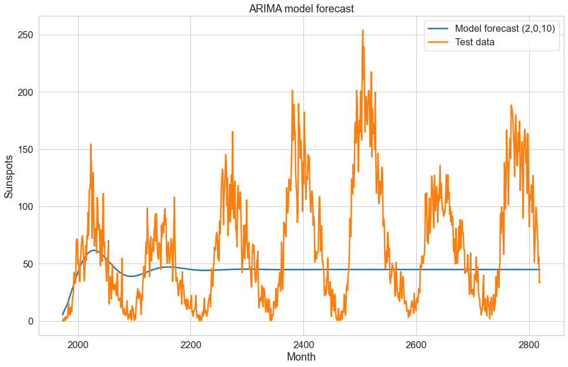
    


```python

'''MAE = median_absolute_error(test['Sunspots'], yhat_ARIMA2)
RMSE = mean_squared_error(test['Sunspots'], yhat_ARIMA2,squared=False)
MAPE = mean_absolute_percentage_error(test['Sunspots'], yhat_ARIMA2)
MASE = MASE_func(train['Sunspots'],test['Sunspots'],yhat_ARIMA2)
print("\nARIMA(8,2,10):")
print('MAE=%.3f'% MAE)
print('RMSE=%.3f'% RMSE)
print('MAPE=%.3f'% MAPE)
print('MASE=%.3f'% MASE)'''

MAE = median_absolute_error(test['Sunspots'], yhat_ARIMA)
RMSE = mean_squared_error(test['Sunspots'], yhat_ARIMA,squared=False)
MAPE = mean_absolute_percentage_error(test['Sunspots'], yhat_ARIMA)
MASE = MASE_func(train['Sunspots'],test['Sunspots'],yhat_ARIMA)
print("ARIMA(2,0,10):")
print('MAE=%.3f'% MAE)
print('RMSE=%.3f'% RMSE)
print('MAPE=%.3f'% MAPE)
print('MASE=%.3f'% MASE)
```

    ARIMA(2,0,10):
    MAE=31.393
    RMSE=54.643
    MAPE=28251642075188.902
    MASE=3.566


```python
# evaluate an ARIMA model for a given order (p,d,q)

#ARIMA model
p_values = [0,1,2,4,8,10]
d_values = range(0,3)
q_values = [0,1,2,4,8,10]
ARIMA3 = pd.DataFrame(columns=['order','AICc','MASE'])
ARIMA4 = evaluate_ARIMA(train_des['Sunspots_des'],test_des['Sunspots_des'] , p_values, d_values, q_values,ARIMA3)
warnings.filterwarnings("ignore")
ARIMA4.head()
```

    Best ARIMA(4, 2, 4) AICc=18.167
    Best ARIMA(4, 2, 4) MASE=1.756


<div>
<style scoped>
    .dataframe tbody tr th:only-of-type {
        vertical-align: middle;
    }

    .dataframe tbody tr th {
        vertical-align: top;
    }

    .dataframe thead th {
        text-align: right;
    }
</style>
<table border="1" class="dataframe">
  <thead>
    <tr style="text-align: right;">
      <th></th>
      <th>order</th>
      <th>AICc</th>
      <th>MASE</th>
    </tr>
  </thead>
  <tbody>
    <tr>
      <th>0</th>
      <td>(0, 0, 0)</td>
      <td>19250.996404</td>
      <td>1.762727</td>
    </tr>
    <tr>
      <th>1</th>
      <td>(0, 0, 1)</td>
      <td>18135.914577</td>
      <td>1.762721</td>
    </tr>
    <tr>
      <th>2</th>
      <td>(0, 0, 2)</td>
      <td>17635.254620</td>
      <td>1.762713</td>
    </tr>
    <tr>
      <th>3</th>
      <td>(0, 0, 4)</td>
      <td>17256.315107</td>
      <td>1.762726</td>
    </tr>
    <tr>
      <th>4</th>
      <td>(0, 0, 8)</td>
      <td>17010.682769</td>
      <td>1.762735</td>
    </tr>
  </tbody>
</table>
</div>


```python
k_i = train_des.index.values[0] + len(train_des)
k_f = k_i + len(test_des) - 1

ARIMA_model3 = ARIMA(train_des['Sunspots_des'], order=(4, 2, 4))
res_ARIMA3 = ARIMA_model3.fit()
yhat_ARIMA3 = res_ARIMA3.predict(start=k_i, end=k_f, dynamic=False)

'''ARIMA_model4 = ARIMA(train_des['Sunspots_des'], order=(4, 2, 4))
res_ARIMA4 = ARIMA_model4.fit()
yhat_ARIMA4 = res_ARIMA4.predict(start=k_i, end=k_f, dynamic=False)'''

plt.figure(figsize=(16, 10))
sns.set_style("whitegrid")
sns.set_context("notebook", font_scale=1.5, rc={"lines.linewidth": 2.5})
ax = sns.lineplot(data=yhat_ARIMA3)
ax.set(xlabel='Month', ylabel = 'Sunspots')
ax.set_title('ARIMA model forecast')
#ax.set_xlim(49,60)
#bx = sns.lineplot(data=yhat_ARIMA4)
cx = sns.lineplot(data=test_des['Sunspots_des'])
plt.legend(labels=["Model forecast (4,2,4)", "Test data"])
plt.show()
warnings.filterwarnings("ignore")
```


    
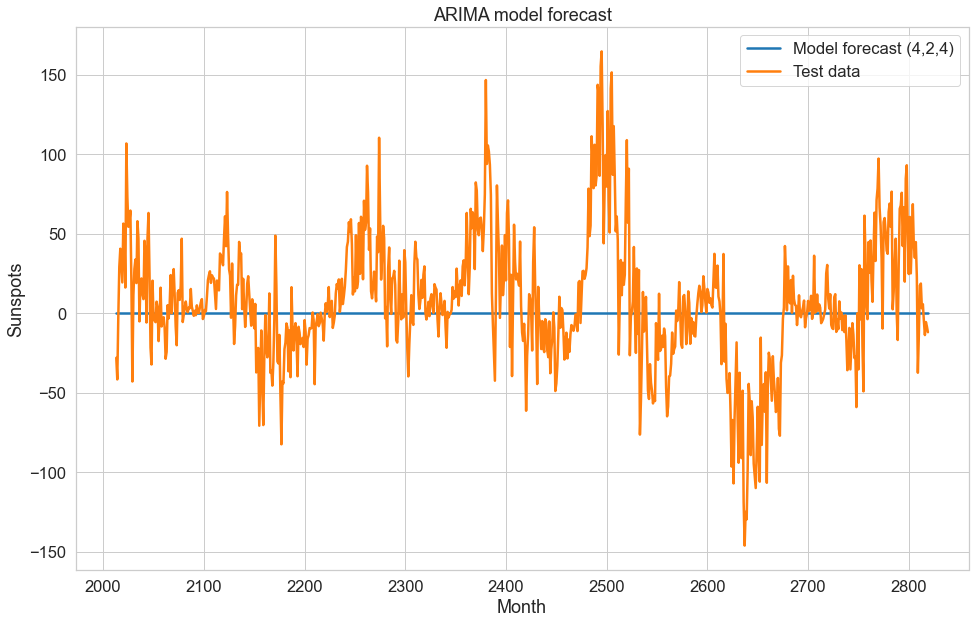
    


```python

'''MAE = median_absolute_error(test_des['Sunspots_des'], yhat_ARIMA4)
RMSE = mean_squared_error(test_des['Sunspots_des'], yhat_ARIMA4,squared=False)
MAPE = mean_absolute_percentage_error(test_des['Sunspots_des'], yhat_ARIMA4)
MASE = MASE_func(train_des['Sunspots_des'],test_des['Sunspots_des'],yhat_ARIMA4)
print("\nARIMA(8,1,10):")
print('MAE=%.3f'% MAE)
print('RMSE=%.3f'% RMSE)
print('MAPE=%.3f'% MAPE)
print('MASE=%.3f'% MASE)'''

MAE = median_absolute_error(test_des['Sunspots_des'], yhat_ARIMA3)
RMSE = mean_squared_error(test_des['Sunspots'], yhat_ARIMA3,squared=False)
MAPE = mean_absolute_percentage_error(test_des['Sunspots_des'], yhat_ARIMA3)
MASE = MASE_func(train_des['Sunspots_des'],test_des['Sunspots_des'],yhat_ARIMA3)
print("ARIMA(4,2,4):")
print('MAE=%.3f'% MAE)
print('RMSE=%.3f'% RMSE)
print('MAPE=%.3f'% MAPE)
print('MASE=%.3f'% MASE)

```

    ARIMA(4,2,4):
    MAE=20.600
    RMSE=84.962
    MAPE=0.996
    MASE=1.756


```python
yhat_ARIMA5 = res_ARIMA3.predict(start=len(train_des['Sunspots_des'])+1, end=(len(df_date)), dynamic=False)

yhat_ARIMA_des = pd.DataFrame().reindex_like(test)
yhat_ARIMA_des['Sunspots_des'] = yhat_ARIMA5
yhat_ARIMA_des['Date'] = test['Date']

m = (len(df_date) - len(df_des))
ki = test.index.values[0]
kf = ki + m
ji = kf + 1
jf = test_des.index.values[0] + len(test_des)

for i in range(ki,kf+1):
    yhat_ARIMA_des.loc[i,'Sunspots'] = yhat_ARIMA_des.loc[i,'Sunspots_des'] + train_des.loc[i-m,'Sunspots']

for i in range(ji,jf):
    yhat_ARIMA_des.loc[i,'Sunspots'] = yhat_ARIMA_des.loc[i,'Sunspots_des'] + yhat_ARMA_des.loc[i-m,'Sunspots']

yhat_ARIMA_des.head()
```


<div>
<style scoped>
    .dataframe tbody tr th:only-of-type {
        vertical-align: middle;
    }

    .dataframe tbody tr th {
        vertical-align: top;
    }

    .dataframe thead th {
        text-align: right;
    }
</style>
<table border="1" class="dataframe">
  <thead>
    <tr style="text-align: right;">
      <th></th>
      <th>Date</th>
      <th>Sunspots</th>
      <th>Sunspots_des</th>
    </tr>
  </thead>
  <tbody>
    <tr>
      <th>1973</th>
      <td>1913-06-01</td>
      <td>1.4</td>
      <td>0.0</td>
    </tr>
    <tr>
      <th>1974</th>
      <td>1913-07-01</td>
      <td>0.9</td>
      <td>0.0</td>
    </tr>
    <tr>
      <th>1975</th>
      <td>1913-08-01</td>
      <td>2.3</td>
      <td>0.0</td>
    </tr>
    <tr>
      <th>1976</th>
      <td>1913-09-01</td>
      <td>7.6</td>
      <td>0.0</td>
    </tr>
    <tr>
      <th>1977</th>
      <td>1913-10-01</td>
      <td>16.3</td>
      <td>0.0</td>
    </tr>
  </tbody>
</table>
</div>


```python
fig, axes = plt.subplots(2,1, figsize=(15, 20))

plt.figure(figsize=(16, 10))
sns.set_style("whitegrid")
sns.set_context("notebook", font_scale=1.5, rc={"lines.linewidth": 2.5})

dx = sns.lineplot(ax=axes[0],data=train_des,x='Date',y='Sunspots_des')
ex = sns.lineplot(ax=axes[0],data=test_des,x='Date',y='Sunspots_des')
fx = sns.lineplot(ax=axes[0],data=yhat_ARIMA_des,x='Date',y='Sunspots_des')
axes[0].set(xlabel='Month', ylabel = 'Sunspots')
axes[0].set_title('ARIMA model forecast - deseasonalized')
axes[0].set_ylim(-200,200)
#axes[0].set_xticks(np.arange(0, 36 + 1, 6))
axes[0].legend(labels=["Train data","Test data","Model Forecast"])

ax = sns.lineplot(ax=axes[1],data=train,x='Date',y='Sunspots')
bx = sns.lineplot(ax=axes[1],data=test,x='Date',y='Sunspots')
cx = sns.lineplot(ax=axes[1],data=yhat_ARIMA_des,x='Date',y='Sunspots')
axes[1].set(xlabel='Month', ylabel = 'Sunspots')
axes[1].set_title('ARIMA model forecast')
axes[1].set_ylim(0,300)
#axes[1].set_xticks(np.arange(0, 36 + 1, 6))
axes[1].legend(labels=["Train data","Test data","Model Forecast"])

plt.show()
```


    

    


    <Figure size 1152x720 with 0 Axes>


```python
MAE = median_absolute_error(test['Sunspots'], yhat_ARIMA_des['Sunspots'])
RMSE = mean_squared_error(test['Sunspots'], yhat_ARIMA_des['Sunspots'],squared=False)
MAPE = mean_absolute_percentage_error(test['Sunspots'], yhat_ARIMA_des['Sunspots'])
MASE = MASE_func(train['Sunspots'],test['Sunspots'],yhat_ARIMA_des['Sunspots'])

print('MAE=%.3f'% MAE)
print('RMSE=%.3f'% RMSE)
print('MAPE=%.3f'% MAPE)
print('MASE=%.3f'% MASE)
```

    MAE=26.489
    RMSE=61.874
    MAPE=7443966326233.635
    MASE=3.740


```python
train_sarimax = train.copy().set_index(['Date'])
train_sarimax.info()
train.info()
```

    <class 'pandas.core.frame.DataFrame'>
    DatetimeIndex: 1973 entries, 1749-01-01 to 1913-05-01
    Data columns (total 1 columns):
     #   Column    Non-Null Count  Dtype  
    ---  ------    --------------  -----  
     0   Sunspots  1973 non-null   float64
    dtypes: float64(1)
    memory usage: 30.8 KB
    <class 'pandas.core.frame.DataFrame'>
    RangeIndex: 1973 entries, 0 to 1972
    Data columns (total 2 columns):
     #   Column    Non-Null Count  Dtype         
    ---  ------    --------------  -----         
     0   Date      1973 non-null   datetime64[ns]
     1   Sunspots  1973 non-null   float64       
    dtypes: datetime64[ns](1), float64(1)
    memory usage: 31.0 KB


```python
df_sar = anual_mean.set_index(['Date'])
train_size = int(len(df_sar) * 0.7)
train_sar, test_sar = df_sar[0:train_size], df_sar[train_size:len(df_date)]
```


```python
fig_auto, axes = plt.subplots(2,1,figsize=(18,20), dpi= 100)
fig_auto.suptitle('ACF and PACF plots')
plot_acf(df_sar['Sunspots'], lags=120, ax=axes[0])
axes[0].set_xlabel('Lag')
plot_pacf(df_sar['Sunspots'], lags=70, ax=axes[1])
axes[1].set_xlabel('Lag')
plt.show()
```


    
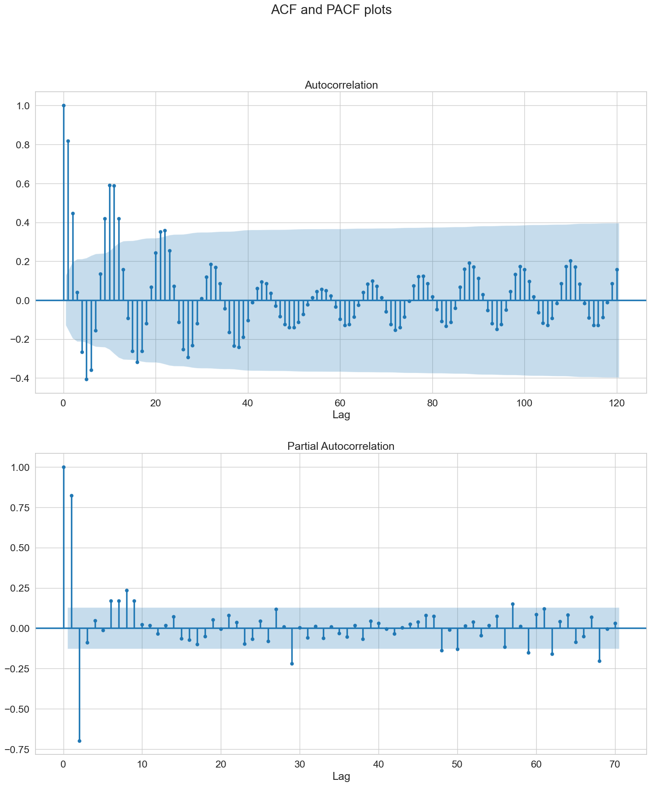
    


```python
#SARIMAX model
import statsmodels.api as sm
import itertools

p = q = range(0,4)
d = range(0,2)
pdq = list(itertools.product(p, d, q))
seasonal_pdq = [(x[0], x[1], x[2], 11) for x in list(itertools.product(p, d, q))]

store = pd.DataFrame(columns=['p,d,q','P,D,Q,s','AIC'])

def sarimax_pdq(pdq, seasonal_pdq,dataset):
    store = pd.DataFrame(columns=['p,d,q','P,D,Q,s','AIC'])
    for param in pdq:
        for param_seasonal in seasonal_pdq:
            try:
                mod = sm.tsa.statespace.SARIMAX(dataset,order=param,seasonal_order=param_seasonal,enforce_stationarity=False,enforce_invertibility=False)
                res_SARIMAX = mod.fit()
                store_int = pd.Series([param,param_seasonal,res_SARIMAX.aic], index=store.columns)
                store = matriz.append(store_int,ignore_index=True)
            except: 
                continue
    return store

store = sarimax_pdq(pdq,seasonal_pdq,train_sar)
best_idx = store['AIC'].idxmin()
print('Best parameters: SARIMAX{}{}'.format(store.iloc[best_idx,0],store.iloc[best_idx,1]))
```

    Best parameters: SARIMAX(3, 1, 3)(3, 1, 3, 11)


```python
mod = sm.tsa.statespace.SARIMAX(train_sar,
                                order=(3, 1, 3),
                                seasonal_order=(3, 1, 3, 11))
res_SARIMAX = mod.fit()
print(res_SARIMAX.summary().tables[1])
```

    ==============================================================================
                     coef    std err          z      P>|z|      [0.025      0.975]
    ------------------------------------------------------------------------------
    ar.L1          1.7234      0.641      2.690      0.007       0.468       2.979
    ar.L2         -1.1562      0.914     -1.265      0.206      -2.948       0.636
    ar.L3          0.1874      0.515      0.364      0.716      -0.822       1.197
    ma.L1         -1.3942      0.653     -2.135      0.033      -2.674      -0.114
    ma.L2          0.4038      0.755      0.535      0.593      -1.076       1.884
    ma.L3          0.1049      0.213      0.493      0.622      -0.312       0.522
    ar.S.L11      -0.6090      0.899     -0.677      0.498      -2.372       1.154
    ar.S.L22      -0.3640      0.826     -0.441      0.659      -1.982       1.254
    ar.S.L33      -0.1881      0.152     -1.240      0.215      -0.486       0.109
    ma.S.L11      -0.1562      0.930     -0.168      0.867      -1.980       1.667
    ma.S.L22      -0.1012      0.671     -0.151      0.880      -1.416       1.214
    ma.S.L33      -0.1403      0.629     -0.223      0.824      -1.374       1.093
    sigma2       230.7661     26.707      8.641      0.000     178.422     283.110
    ==============================================================================


```python
res_SARIMAX.plot_diagnostics(figsize=(18, 10))
plt.show()
```


    
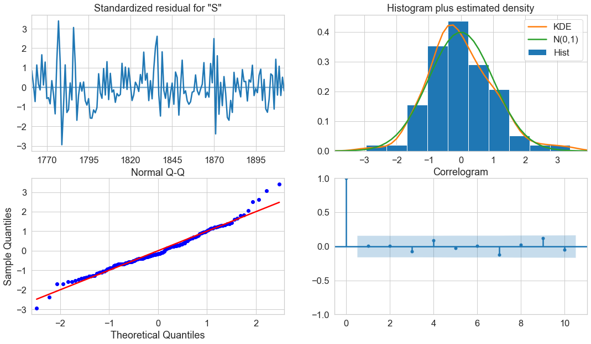
    


```python
yhat_SARIMAX = res_SARIMAX.predict(start=len(train_sar)+1, end=(len(df_sar)), dynamic=False)

plt.figure(figsize=(16, 10))
sns.set_style("whitegrid")
sns.set_context("notebook", font_scale=1.5, rc={"lines.linewidth": 2.5})
ax = sns.lineplot(data=yhat_SARIMAX,color = 'green')
bx = sns.lineplot(data=train_sar.squeeze())
cx = sns.lineplot(data=test_sar.squeeze())
ax.set(xlabel='Month', ylabel = 'Sunspots')
ax.set_title('SARIMAX model forecast')
ax.set_xlim('1749-01-01','1984-01-01')
#ax.set_ylim(-50,300)

fcast = res_SARIMAX.get_prediction(start=len(train_sar)+1, end=(len(df_sar)), dynamic=False).summary_frame()
ax.fill_between(fcast.index, fcast['mean_ci_lower'], fcast['mean_ci_upper'], color='k', alpha=0.1);

plt.legend(labels=["Model forecast (3, 1, 3)(3, 1, 3)11", "Train data", "Test data"])
plt.show()
```


    
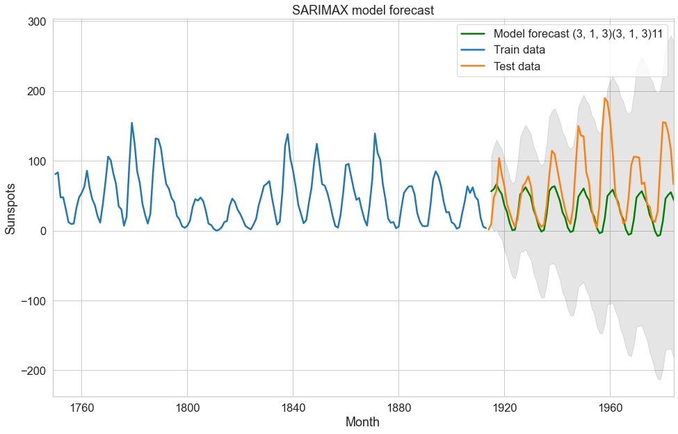
    


```python
MAE = median_absolute_error(test_sar, yhat_SARIMAX)
RMSE = mean_squared_error(test_sar, yhat_SARIMAX,squared=False)
MAPE = mean_absolute_percentage_error(test_sar, yhat_SARIMAX)
MASE = MASE_func(train_sar['Sunspots'],test_sar['Sunspots'],yhat_SARIMAX)

print('MAE=%.3f'% MAE)
print('RMSE=%.3f'% RMSE)
print('MAPE=%.3f'% MAPE)
print('MASE=%.3f'% MASE)
```

    MAE=29.452
    RMSE=51.723
    MAPE=1.308
    MASE=2.327


```python
mod1 = sm.tsa.statespace.SARIMAX(train_sar,
                                order=(6, 1, 22),
                                seasonal_order=(1, 1, 0, 11))
res_SARIMAX1 = mod1.fit()
print(res_SARIMAX1.summary().tables[1])
```

    ==============================================================================
                     coef    std err          z      P>|z|      [0.025      0.975]
    ------------------------------------------------------------------------------
    ar.L1          0.1319      1.998      0.066      0.947      -3.784       4.048
    ar.L2         -0.1163      0.879     -0.132      0.895      -1.840       1.607
    ar.L3         -0.2864      0.625     -0.458      0.647      -1.511       0.938
    ar.L4         -0.1814      0.719     -0.252      0.801      -1.590       1.227
    ar.L5         -0.0448      0.623     -0.072      0.943      -1.266       1.176
    ar.L6         -0.1555      0.597     -0.260      0.794      -1.325       1.014
    ma.L1          0.1765      1.902      0.093      0.926      -3.551       3.904
    ma.L2         -0.0508      1.478     -0.034      0.973      -2.948       2.846
    ma.L3         -0.0624      1.012     -0.062      0.951      -2.046       1.921
    ma.L4          0.0300      1.118      0.027      0.979      -2.161       2.221
    ma.L5         -0.2865      1.130     -0.254      0.800      -2.501       1.928
    ma.L6         -0.1401      1.163     -0.120      0.904      -2.420       2.140
    ma.L7         -0.3101      0.988     -0.314      0.754      -2.247       1.627
    ma.L8         -0.1175      0.968     -0.121      0.903      -2.016       1.781
    ma.L9          0.2610      0.878      0.297      0.766      -1.460       1.982
    ma.L10         0.1594      0.609      0.262      0.793      -1.034       1.352
    ma.L11        -0.8025      0.790     -1.016      0.310      -2.351       0.746
    ma.L12         0.0098      1.271      0.008      0.994      -2.482       2.501
    ma.L13         0.0642      0.724      0.089      0.929      -1.354       1.482
    ma.L14        -0.0990      0.431     -0.229      0.819      -0.944       0.746
    ma.L15        -0.1492      0.370     -0.403      0.687      -0.875       0.576
    ma.L16         0.1832      0.365      0.502      0.616      -0.532       0.899
    ma.L17         0.2760      0.386      0.715      0.475      -0.481       1.033
    ma.L18         0.2415      0.832      0.290      0.772      -1.390       1.873
    ma.L19        -0.0186      0.890     -0.021      0.983      -1.764       1.727
    ma.L20        -0.3008      0.514     -0.585      0.559      -1.309       0.707
    ma.L21        -0.1733      0.714     -0.243      0.808      -1.572       1.226
    ma.L22         0.1198      0.545      0.220      0.826      -0.948       1.188
    ar.S.L11       0.0797      0.462      0.173      0.863      -0.826       0.985
    sigma2       182.3522    183.583      0.993      0.321    -177.464     542.168
    ==============================================================================


```python
res_SARIMAX1.plot_diagnostics(figsize=(18, 10))
plt.show()
```


    

    


```python
yhat_SARIMAX1 = res_SARIMAX1.predict(start=len(train_sar)+1, end=(len(df_sar)), dynamic=False)

plt.figure(figsize=(16, 10))
sns.set_style("whitegrid")
sns.set_context("notebook", font_scale=1.5, rc={"lines.linewidth": 2.5})
ax = sns.lineplot(data=yhat_SARIMAX1,color = 'green')
bx = sns.lineplot(data=train_sar.squeeze())
cx = sns.lineplot(data=test_sar.squeeze())
ax.set(xlabel='Month', ylabel = 'Sunspots')
ax.set_title('SARIMAX model forecast')
ax.set_xlim('1749-01-01','1984-01-01')
#ax.set_ylim(-50,300)

fcast1 = res_SARIMAX1.get_prediction(start=len(train_sar)+1, end=(len(df_sar)), dynamic=False).summary_frame()
ax.fill_between(fcast1.index, fcast1['mean_ci_lower'], fcast1['mean_ci_upper'], color='k', alpha=0.1);

plt.legend(labels=["Model forecast (6, 1, 22)(1, 1, 0)11", "Train data", "Test data"])
plt.show()
```


    
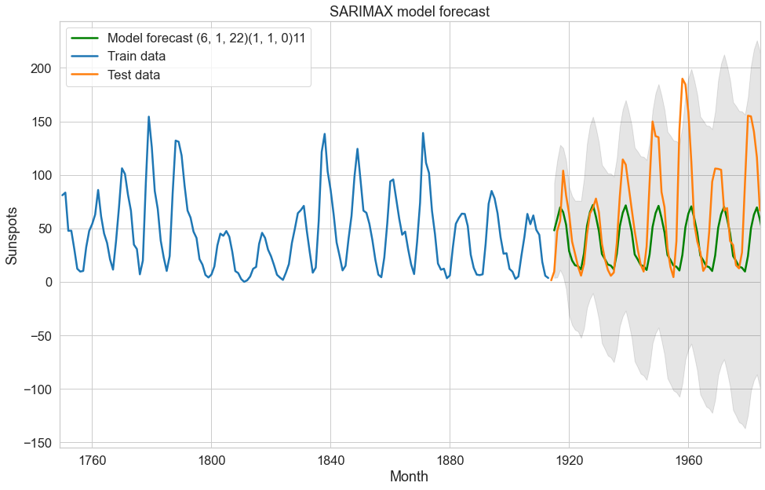
    


```python
MAE = median_absolute_error(test_sar, yhat_SARIMAX1)
RMSE = mean_squared_error(test_sar, yhat_SARIMAX1,squared=False)
MAPE = mean_absolute_percentage_error(test_sar, yhat_SARIMAX1)
MASE = MASE_func(train_sar['Sunspots'],test_sar['Sunspots'],yhat_SARIMAX1)

print('MAE=%.3f'% MAE)
print('RMSE=%.3f'% RMSE)
print('MAPE=%.3f'% MAPE)
print('MASE=%.3f'% MASE)
```

    MAE=23.657
    RMSE=46.857
    MAPE=1.069
    MASE=2.030


----------------------

## 3. Conclusion

In this notebook, we were able to analyze and forecast a time series. After preparing the data, we did an intial exploratory analysis to verify if there were any seasonal or ciclic pattern in the time series. We needed to differencing our data to remove the trend component and the seasonal component. Then, we used the ADH and KPSS tests to verifiy if the resulting data series was really stationary. Next, we started constructing our forecast model. Fisrt, we split the data in training and testing data sets and used a simple average forecast. This method did not performed well, so we tested ARIMA models:

1. Autoregressive model (AR)
2. Moving average model (MA)
3. Autoregressive moving average model (ARMA)
4. Autoregressive integrated moving average model (ARIMA)

As this models did not perform well too, we tried a seasonal ARIMA method, the SARIMA.

We verified that none of the models SARIMA method, as expected, performed better than the previous methods. However, due to the high computing cost of the SARIMA, the method was trained and tested using a downsampled version of the dataset.
